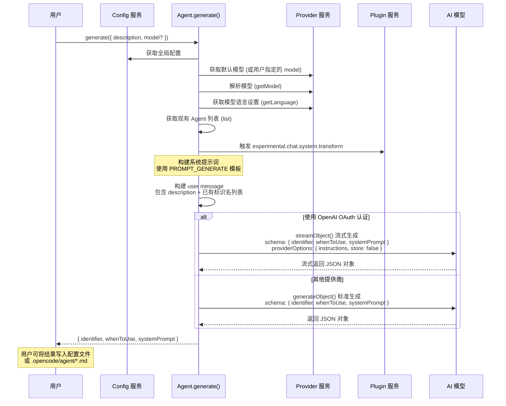

# Agent 系统

Agent 是 OpenCode 的核心抽象层，用于定义 AI 助手的行为模型、权限边界和系统提示词。每个 Agent 拥有独立的权限规则集、可选的专属模型配置和系统提示词，使其能够在不同的场景下以不同的身份和权限运行。

## 数据模型

一个 Agent 由 `Agent.Info` 类型描述，其核心字段如下：

| 字段 | 类型 | 必填 | 说明 |
|------|------|------|------|
| `name` | `string` | 是 | Agent 的唯一标识名称 |
| `description` | `string` (可选) | 否 | Agent 的功能描述，用于展示和自动匹配 |
| `mode` | `"subagent" \| "primary" \| "all"` | 是 | 运行模式：主 Agent（驱动会话）、子 Agent（被 Task 工具调用）、通用（两者皆可） |
| `native` | `boolean` (可选) | 否 | 是否为内置 Agent（由系统预定义，不可删除） |
| `hidden` | `boolean` (可选) | 否 | 是否在 UI 列表中隐藏（如 compaction、title、summary 等后台 Agent） |
| `temperature` | `float` (可选) | 否 | 模型温度参数，控制输出随机性 |
| `topP` | `float` (可选) | 否 | 模型 top_p 参数，核采样阈值 |
| `color` | `string` (可选) | 否 | 用于 UI 展示的颜色标识（十六进制色值或主题色名） |
| `permission` | `Permission.Ruleset` | 是 | 权限规则集，定义 Agent 可以使用的工具及权限策略 |
| `model` | `{ modelID, providerID }` (可选) | 否 | 指定 Agent 使用的模型和提供商，未指定则使用全局默认模型 |
| `variant` | `string` (可选) | 否 | 模型变体标识（仅在 Agent 使用其配置的 model 时生效） |
| `prompt` | `string` (可选) | 否 | Agent 的系统提示词，定义其行为、角色和约束 |
| `options` | `Record<string, unknown>` | 是 | 扩展选项，存储任意键值对（如 reference 原始配置） |
| `steps` | `number` (可选) | 否 | Agent 循环的最大迭代步数，超出后强制输出纯文本响应 |

## 内置 Agent

OpenCode 预定义了八个内置 Agent，其中四个为面向用户的功能 Agent，三个为后台辅助 Agent，一个为实验性功能 Agent。

### 1. build（主 agent，默认）

- **模式**: `primary`
- **类型**: 原生内置
- **描述**: 默认主 Agent，根据配置的权限执行工具调用，是用户交互的主要入口。

**权限**:
- 继承默认权限的全部规则
- 额外允许：`question:allow`（可以向用户提问）、`plan_enter:allow`（可以进入计划模式）

**配置默认代理**: 当用户没有配置 `default_agent` 时，系统自动选择第一个可见的 primary Agent 作为默认。`build` 是约定俗成的首个默认主 Agent。

---

### 2. plan（计划模式 Agent）

- **模式**: `primary`
- **类型**: 原生内置
- **描述**: 计划模式 Agent，禁止所有编辑工具，只能查看和写入计划文件。

**权限**:
- 继承默认权限的全部规则
- 额外允许：`question:allow`、`plan_exit:allow`（可退出计划模式）
- 外部目录：允许写入数据目录下的 `plans/*` 路径
- **编辑限制**:
  - `edit:*:deny` —— 禁止所有编辑操作
  - 仅允许编辑 `.opencode/plans/*.md` 和工作区内映射到全局数据 `plans/*.md` 的计划文件
  - `write`、`edit`、`apply_patch` 工具全部禁用

**用途**: 当需要先制定计划再执行时，切换到 plan Agent。它在不修改代码的前提下进行调查和规划，将方案写入 `.opencode/plans/` 目录，完成后退出计划模式，由主 Agent 继续执行。

---

### 3. general（通用子 Agent）

- **模式**: `subagent`
- **类型**: 原生内置
- **描述**: 通用子 Agent，用于并行执行复杂的多步骤任务。适合需要同时处理多个独立工作单元的场景。

**权限**:
- 继承默认权限的全部规则
- 额外拒绝：`todowrite:deny`（不允许写入待办列表，避免嵌套调度混乱）
- 不限制 `task` 权限（因此子 Agent 可以进一步派生子任务，形成嵌套调度）

**用途**: 通过 Task 工具被主 Agent 调用，适合"请并行完成 A、B、C 三个独立任务"的模式。

---

### 4. explore（探索 Agent）

- **模式**: `subagent`
- **类型**: 原生内置
- **描述**: 快速、只读的代码库探索专家。使用 `PROMPT_EXPLORE` 系统提示词。

**权限**（严格只读限制）:
- 默认所有工具：`*:deny`
- 仅允许：
  - `grep:allow` —— 正则搜索文件内容
  - `glob:allow` —— 通配符匹配文件路径
  - `list:allow` —— 列出目录内容
  - `bash:allow` —— 执行只读 shell 命令
  - `webfetch:allow` —— 抓取网页内容
  - `websearch:allow` —— 网络搜索
  - `read:allow` —— 读取文件
  - `external_directory` —— 允许访问截断文件缓存、临时文件和 skill 目录

**系统提示词核心要求**:
- 快速定位文件（用 glob）、搜索代码（用 grep）、读取分析内容
- 根据调用者指定的彻底程度（quick/medium/very thorough）调整搜索策略
- 返回绝对文件路径，不使用 emoji
- 禁止创建文件或执行任何修改系统状态的 bash 命令

**用途**: 被主 Agent 调用以快速大规模搜索代码库，例如"查找 src/components/**/*.tsx 中的所有 API 端点定义"。

---

### 5. scout（文档/依赖研究 Agent，实验性功能）

- **模式**: `subagent`
- **类型**: 原生内置
- **功能开关**: 仅在启用 `OPENCODE_EXPERIMENTAL_SCOUT` 特性标志时生效
- **描述**: 外部文档和依赖源码专家。使用 `PROMPT_SCOUT` 系统提示词。

**权限**:
- 默认所有工具：`*:deny`
- 仅允许：
  - `grep:allow`、`glob:allow` —— 搜索文件
  - `webfetch:allow`、`websearch:allow` —— 网络研究
  - `codesearch:allow` —— 代码搜索
  - `read:allow` —— 读取文件
  - `repo_clone:allow` —— 克隆外部仓库到受管理的缓存目录
  - `repo_overview:allow` —— 获取仓库结构概览
  - `external_directory` —— 允许访问截断缓存、临时文件、skill 目录和仓库缓存目录

**系统提示词核心要求**:
- 研究外部库和依赖的源码（通过 `repo_clone` 克隆后使用 Glob/Grep/Read 检查）
- 使用 `WebFetch` 补充官方文档证据
- 引用精确的绝对文件路径和行号
- 区分已验证的证据和推断的结论
- 不要修改工作区文件

**用途**: 需要检查第三方库实现细节、对比本地代码与上游源码、研究外部 API 行为时使用。

---

### 6. compaction（上下文压缩 Agent）

- **模式**: `primary`
- **类型**: 原生内置，隐藏
- **描述**: 负责在会话上下文过长时压缩历史记录。使用 `PROMPT_COMPACTION` 系统提示词。

**权限**: 所有权限拒绝（`*:deny`），仅执行纯文本处理。

**用途**: 系统内部自动调用，对终端用户不可见。

---

### 7. title（标题生成 Agent）

- **模式**: `primary`
- **类型**: 原生内置，隐藏
- **参数**: `temperature: 0.5`
- **描述**: 为会话自动生成简短标题。使用 `PROMPT_TITLE` 系统提示词。

**权限**: 所有权限拒绝（`*:deny`），仅执行纯文本处理。

**用途**: 系统在新会话开始时自动调用，生成便于用户检索的会话标题。

---

### 8. summary（摘要生成 Agent）

- **模式**: `primary`
- **类型**: 原生内置，隐藏
- **描述**: 为会话生成变更摘要。使用 `PROMPT_SUMMARY` 系统提示词。

**权限**: 所有权限拒绝（`*:deny`），仅执行纯文本处理。

**用途**: 系统内部调用，生成类似 Pull Request 描述的会话摘要。

---

### 内置 Agent 权限总览

```
                  *  doom_loop  ext_dir  question  plan_enter  plan_exit  repo_clone  repo_overview  read(*.env)  特殊规则
build           allow   ask       ask      allow     allow       deny       deny        deny           ask
plan            allow   ask       ask      allow     deny        allow      deny        deny           ask         edit:*:deny
general         allow   ask       ask      deny      deny        deny       deny        deny           ask         todowrite:deny
explore         deny    -         ask*     -         -           -          -           -              -          仅 read/grep/glob/list/bash/webfetch/websearch
scout           deny    -         ask*     -         -           -          allow       allow         -           仅 read/grep/glob/webfetch/websearch/codesearch
compaction      deny    -         -        -         -           -          -           -              -           *:deny
title           deny    -         -        -         -           -          -           -              -           *:deny
summary         deny    -         -        -         -           -          -           -              -           *:deny
```

*注：`-` 表示继承默认规则（deny）；`ext_dir` 为 `external_directory` 的缩写；explore 和 scout 的 ext_dir 使用 `readonlyExternalDirectory`（发布/截断/临时/skill 目录为 allow，其余为 ask）。*

---

## 权限合并策略

### 核心概念

Agent 的权限由 **三条规则集** 通过 `Permission.merge()` 合并而来：

1. **默认权限 (`defaults`)**：系统级安全基线，对所有 Agent 生效。
2. **Agent 自定义权限**：每个内置 Agent 在默认权限基础上追加的专属规则。
3. **用户配置权限 (`user`)**：用户在 `permission` 配置字段中自定义的规则。

### 默认权限规则

```
*                          → allow    （默认允许所有工具）
doom_loop                  → ask      （死循环检测需用户确认）
external_directory:*       → ask      （外部目录访问需用户确认）
question                   → deny     （默认禁止向用户提问）
plan_enter                 → deny     （默认禁止进入计划模式）
plan_exit                  → deny     （默认禁止退出计划模式）
repo_clone                 → deny     （默认禁止克隆仓库）
repo_overview              → deny     （默认禁止仓库概览）
read:*.env                 → ask      （读取 .env 文件需用户确认）
read:*.env.*               → ask      （读取 .env.* 文件需用户确认）
read:*.env.example         → allow    （.env.example 示例文件允许读取）
```

此外，`Truncate.GLOB`（截断文件缓存的 glob 路径）会被自动加入 `external_directory:allow`，除非用户显式配置了 deny。

### merge 算法

`Permission.merge(...rulesets: Ruleset[])` 的实现非常简洁：

```typescript
export function merge(...rulesets: Ruleset[]): Ruleset {
  return rulesets.flat()
}
```

合并的本质是**将所有规则集展开（flat）为一个规则数组**，不做去重或优先级处理。权限求值时，系统通过 `ruleset.findLast()` 从数组末尾向前查找第一个匹配的规则——即**越晚加入的规则优先级越高**。

合并顺序为：

```
Permission.merge(defaults, agentSpecific, user)
```

因此优先级为：**用户配置 > Agent 特定配置 > 默认配置**。

### 白名单目录

以下目录在 Agent 初始化时自动加入 `external_directory` 的白名单，操作级别为 `allow`：

| 目录 | 说明 |
|------|------|
| `Truncate.GLOB` | 截断文件缓存目录（用于上下文压缩时读写临时文件） |
| `Global.Path.tmp/*` | 系统临时目录 |
| `skill.dirs/*` | 所有 Skill 目录（每个目录路径 + `/*`） |

这些白名单确保 Agent 在正常执行流程中不会被外部目录访问的 `ask` 规则打断。

### 子 Agent 会话权限派生

当主 Agent 通过 Task 工具派生子 Agent 时，子 Agent 的会话权限不是简单复制自身规则集，还需要继承父级约束。`deriveSubagentSessionPermission()` 函数定义了这一策略：

1. **继承父 Agent 的全部 deny 规则** —— 确保 Plan Mode 等 Agent 级别的限制不会被绕过。
2. **继承父会话的 deny 规则和 external_directory 规则** —— 确保会话级别的权限限制向下传递。
3. **默认拒绝 `todowrite` 和 `task`** —— 除非子 Agent 自身的规则集中已明确允许。

这条策略防止了子 Agent 绕过父级限制（例如 Plan Mode 的子 Agent 也不应能执行编辑操作）。

---

## 自定义 Agent 配置

### 配置方式

用户可以通过 `opencode.json` 或项目配置文件的 `agent` 字段来自定义 Agent，也可通过 Markdown 文件以声明式方式定义。

#### 方式一：配置文件字段

在 `opencode.json` 中通过 `agent` 字典配置：

```json
{
  "agent": {
    "code-reviewer": {
      "description": "Reviews code changes for quality and correctness",
      "mode": "subagent",
      "prompt": "You are an expert code reviewer...",
      "temperature": 0.3,
      "color": "#00FF00",
      "hidden": false,
      "steps": 15,
      "model": "anthropic/claude-sonnet-4-20250514",
      "permission": {
        "read": "allow",
        "grep": "allow",
        "glob": "allow",
        "edit": "deny"
      }
    }
  }
}
```

#### 方式二：Markdown 文件

在以下目录创建 Markdown 文件：

- `.opencode/agent/<agent-name>.md`
- `.opencode/agents/<agent-name>.md`
- `.opencode/mode/<mode-name>.md`（mode 文件自动设为 `mode: "primary"`）
- `.opencode/modes/<mode-name>.md`

Markdown 文件的结构为 YAML frontmatter + Markdown 正文：

```markdown
---
description: Reviews PRs for security vulnerabilities and code quality
mode: subagent
temperature: 0.2
color: "#FF5733"
steps: 20
---

You are an elite security code reviewer. Your task is to...

## Process
1. Read the diff or changed files...
2. Identify potential security issues...

## Rules
- Always cite exact file paths and line numbers...
```

- **文件名**（去掉扩展名）自动成为 Agent 的 `name`
- **frontmatter** 部分提供结构化元数据
- **正文** 成为 Agent 的 `prompt`（系统提示词）

### 配置字段详解

| 字段 | 类型 | 说明 |
|------|------|------|
| `model` | `string` | 格式为 `providerID/modelID`，如 `anthropic/claude-sonnet-4-20250514` |
| `variant` | `string` | 模型变体，仅在 Agent 使用其配置的 model 时生效 |
| `temperature` | `float` | 温度参数 (0-2) |
| `top_p` | `float` | 核采样阈值 (0-1) |
| `prompt` | `string` | 系统提示词 |
| `description` | `string` | Agent 描述，决定何时使用该 Agent |
| `mode` | `"subagent" \| "primary" \| "all"` | 运行模式 |
| `hidden` | `boolean` | 是否在 @ 自动补全菜单中隐藏（仅对 subagent 有效） |
| `color` | `string` | 十六进制色值（#RRGGBB）或主题色名（primary/secondary/accent 等） |
| `steps` | `number` | Agent 循环的最大迭代步数 |
| `permission` | `PermissionConfig` | 权限配置对象 |
| `disable` | `boolean` | 设为 true 可禁用某个内置 Agent 或自定义 Agent |
| `name` | `string` | 覆盖 Agent 的显示名称 |
| `options` | `object` | 自定义扩展选项 |

### 配置覆盖与合并规则

当用户配置与内置 Agent 或已有自定义 Agent 冲突时：

1. **如果配置中 `disable: true`**：该 Agent 被直接删除，不可用。
2. **如果 Agent 名称已存在**：用户提供的字段会**覆盖**内置/已有字段（`temperature`、`prompt`、`mode` 等直接覆盖，`permission` 通过 `Permission.merge` 叠加，`options` 通过深度合并 `mergeDeep` 整合）。
3. **如果 Agent 名称不存在**：创建一个新的非原生 Agent，默认 `mode: "all"`，权限为 `Permission.merge(defaults, user)`。

---

## Agent 生成流程

OpenCode 提供 AI 驱动的 Agent 生成功能，允许用户通过自然语言描述来创建新的 Agent。此功能由 `Agent.generate()` 方法实现。

### 输入参数

```typescript
interface GenerateInput {
  description: string  // 用自然语言描述想要的 Agent 功能
  model?: { providerID: string; modelID: string }  // 可选，指定生成用的模型
}
```

### 输出格式

```typescript
interface GenerateOutput {
  identifier: string     // Agent 的唯一标识名（小写字母、数字、连字符）
  whenToUse: string      // 何时使用该 Agent 的精确描述
  systemPrompt: string   // Agent 的完整系统提示词
}
```

### 生成流程



### 生成阶段详解

1. **触发**: 用户调用 `generate()` 并传入自然语言描述（如"创建一个检查代码安全性的 Agent"）。

2. **模型选择**: 优先使用用户指定的模型，否则使用全局默认模型。

3. **获取已有标识**: 调用 `list()` 获取所有已存在的 Agent 名称，传入 AI 以防止重名。

4. **构建提示词**:
   - 系统提示词：使用 `PROMPT_GENERATE` 模板，该模板指导 AI 扮演 Agent 架构师角色
   - 触发 `experimental.chat.system.transform` 插件钩子进行系统提示词转换
   - 用户消息包含：功能描述 + 禁止使用的已有标识名列表

5. **模式生成**: AI 按照 `zod` schema `{ identifier, whenToUse, systemPrompt }` 生成结构化输出。

6. **返回结果**: 返回的 JSON 对象可直接用于配置新 Agent。

### PROMPT_GENERATE 模板要点

系统提示词 `PROMPT_GENERATE` 要求 AI：
- **提取核心意图**: 识别用户描述中的显式和隐式需求
- **设计专家角色**: 创建有深度领域知识的 Agent 身份
- **构建完整指令**: 包含行为边界、方法论、边界情况处理、输出格式期望
- **优化性能**: 包含决策框架、质量控制机制、高效工作流、降级策略
- **创建标识符**: 小写字母+数字+连字符，2-4 个词，避免"helper""assistant"等通用术语

---

## Reference Agent（Scout 引用子 Agent）

当启用 `OPENCODE_EXPERIMENTAL_SCOUT` 特性标志时，系统会从配置的 `reference` 字段中自动生成只读子 Agent，称为 Reference Agent。这些 Agent 用于处理 `@` 引用（如 `@react`、`@my-lib`），允许 AI 研究外部仓库和本地目录的内容。

### 触发条件

- `Flag.OPENCODE_EXPERIMENTAL_SCOUT` 为 true
- 用户在配置中定义了 `reference` 字段

### 创建流程

对于每一组已解析的 `reference` 配置：

1. **命名**: 使用 reference 的 `name` 作为 Agent 名称。如果同名 Agent 已存在，则跳过不创建。

2. **权限继承**: 基础权限复制自 `agents.scout` 的权限集，然后叠加额外规则：
   - `repo_clone:deny` —— 禁止 Reference Agent 自行克隆（仓库由系统预先物化）
   - 对于本地目录引用 (`kind === "local"`)，将目录路径加入 `external_directory:allow`

3. **系统提示词生成**: 根据 reference 的类型动态生成：

   - **本地引用 (`kind === "local"`)**:
     ```
     You are configured reference @<name>, a read-only research agent for external reference material.

     Local directory: <path>
     Inspect this directory as the primary reference source. Prefer repo_overview with path "<path>" before broader searches. Do not edit files.

     Return exact absolute file paths for findings whenever possible.
     ```

   - **无效引用 (`kind === "invalid"`)**:
     ```
     You are configured reference @<name>, but this reference is not usable yet.
     Configured repository: <repository>
     Problem: <message>
     Explain this configuration problem if invoked. Do not edit files or attempt fallback clones.
     ```

   - **Git 仓库引用 (`kind === "git"`)**:
     ```
     You are configured reference @<name>, a read-only research agent for external reference material.
     Repository: <repository>
     Branch/ref: <branch>
     Cached directory: <path>
     OpenCode materializes this configured repository before use. Do not call repo_clone for this reference.
     Inspect the cached directory as the primary reference source. Prefer repo_overview with path "<path>" before broader searches, then use Glob, Grep, and Read inside that directory. Do not edit files.
     Return exact absolute file paths for findings whenever possible.
     ```

4. **描述生成**: 同样根据类型动态生成（如"Scout reference for repository <repo>"）。

5. **选项传递**: Agent 的 `options` 字段保留原始 reference 配置和解析后的数据，供运行时使用。

### 属性

所有 Reference Agent 具有以下共同属性：
- `mode: "subagent"` —— 只能作为子 Agent 被调用
- `native: false` —— 非内置，由配置动态生成
- 权限严格只读 —— 禁止编辑、禁止自行克隆仓库
- 返回精确的绝对文件路径

---

## Agent 服务接口

Agent 系统通过 `Agent.Service` 暴露以下接口：

```typescript
export interface Interface {
  get(agent: string): Effect<Info>              // 按名称获取单个 Agent 的完整信息
  list(): Effect<Info[]>                         // 列出所有 Agent（默认 Agent 排第一，其余按字母序）
  defaultAgent(): Effect<string>                 // 获取当前默认 Agent 的名称
  generate(input): Effect<{ identifier, whenToUse, systemPrompt }>  // AI 生成新 Agent 配置
}
```

### get(agent)

从 InstanceState 的 `agents` 字典中按名称返回 Agent 配置。未找到时返回 `undefined`。

### list()

返回所有 Agent 的数组，排序规则：
1. 默认 Agent (`config.default_agent` ?: `build`) 排在第一位
2. 其余 Agent 按名称字母序排列

### defaultAgent()

确定默认 Agent 的逻辑：
1. 如果用户配置了 `default_agent`，找到该 Agent —— 必须是存在的、非 subagent、非 hidden 的 Agent，否则抛出错误。
2. 如果未配置，选择第一个可见的 primary Agent（`mode !== "subagent" && hidden !== true`）作为默认。
3. 如果没有任何符合条件的 Agent，抛出错误。

### generate(input)

如前文 [Agent 生成流程](#agent-生成流程) 所述。

## Agent 在会话中的生命周期

1. **初始化阶段**: 系统启动时调用 `Agent.state()` effect，合并内置 Agent、用户配置和 Reference Agent，构建完整的 `agents` 字典。

2. **Agent 选择**:
   - 主会话启动时调用 `defaultAgent()` 确定默认 Agent
   - 用户可通过配置或交互切换当前 Agent
   - Task 工具调用子 Agent 时指定名称

3. **权限求值**: 当 Agent 尝试执行工具调用时，权限系统基于 Agent 的 `permission` 规则集进行求值——从规则数组末尾向前查找第一个匹配的 `(permission, pattern)` 规则，返回 `allow`/`deny`/`ask`。

4. **子 Agent 派生**: 主 Agent 通过 Task 工具创建子 Agent 时，子会话的权限通过 `deriveSubagentSessionPermission()` 合并父 Agent 的 deny 规则、父会话的 deny 和 external_directory 规则，并默认拒绝 `todowrite` 和 `task`。

5. **隐藏 Agent 调用**: 系统在后台自动调用隐藏 Agent（compaction、title、summary），不暴露给用户交互界面。

6. **Agent 迭代追踪**: 如果 Agent 配置了 `steps` 字段，系统跟踪该 Agent 的迭代次数，超过限制后强制转为纯文本响应，防止无限循环。
