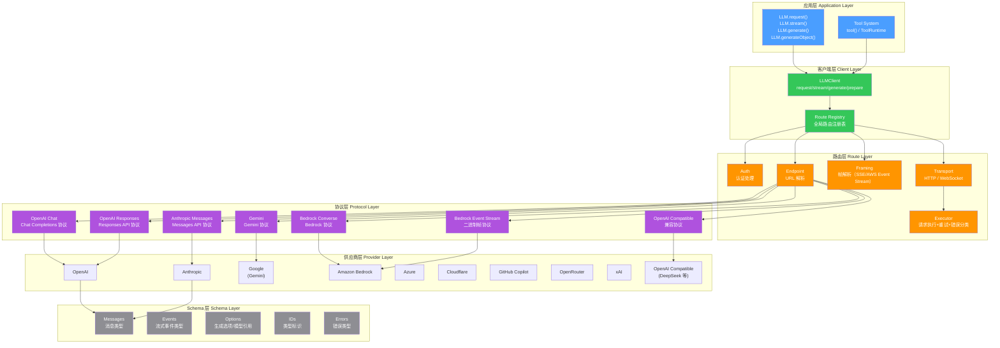
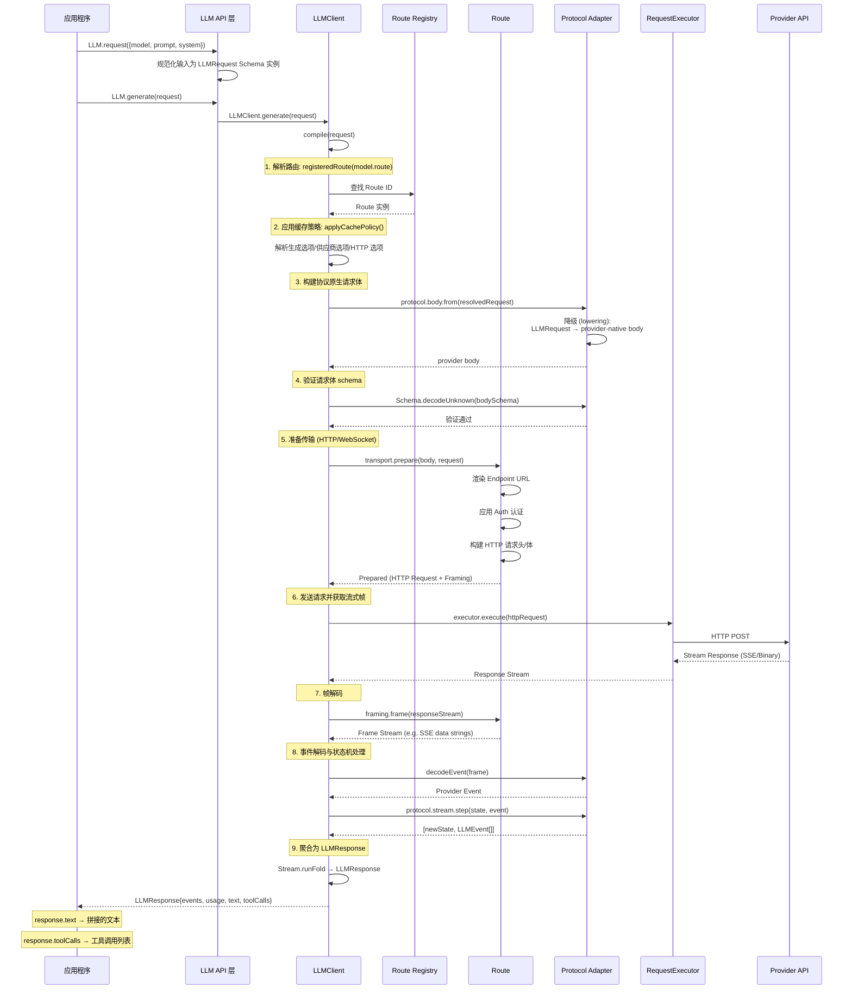
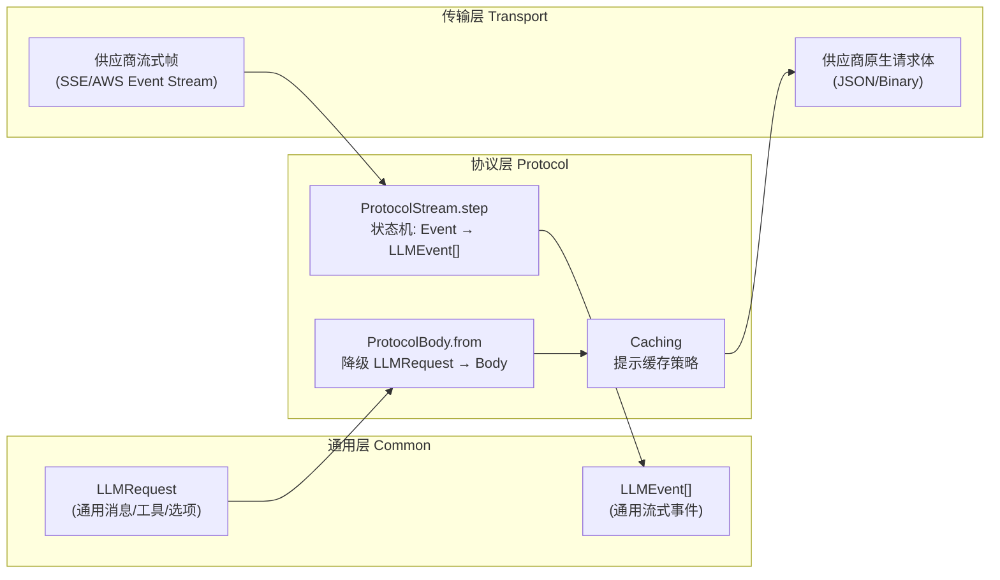
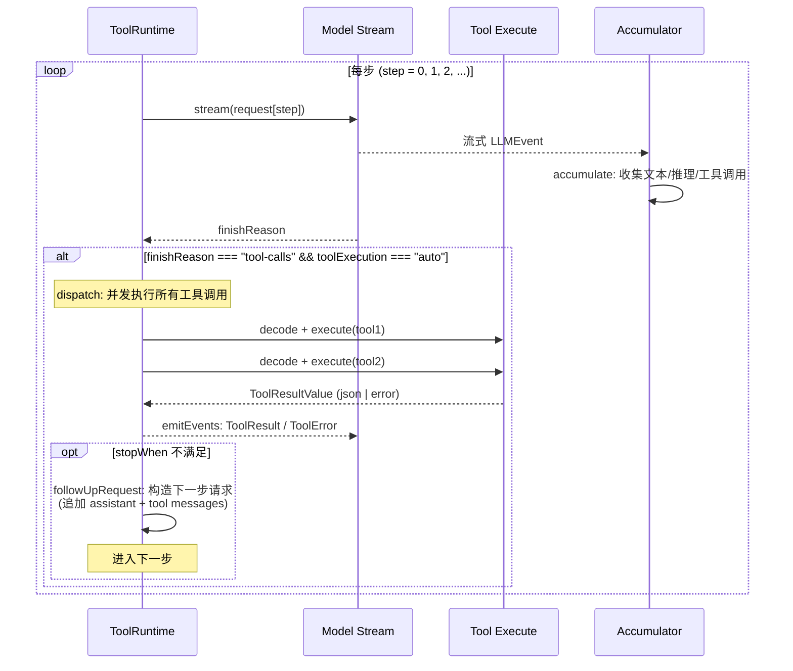

# @opencode-ai/llm — LLM核心包文档

## 一、包概述

`@opencode-ai/llm` 是 OpenCode 的 Schema-first LLM 核心包，提供与供应商（Provider）无关的模型路由和工具执行能力。它定义了一套统一的请求/响应/事件/工具类型语言，将各供应商的协议差异封装在适配器层，调用方代码无需感知底层供应商具体实现。

**版本**：`1.14.48`

**核心依赖**：`effect`（Effect 框架）、`@smithy/eventstream-codec`、`aws4fetch`

**导出入口**（`package.json` 中定义的 `exports`）：

| 入口路径 | 说明 |
|----------|------|
| `@opencode-ai/llm` | 主入口，LLM 客户端、API、Schema、Tool |
| `@opencode-ai/llm/route` | 路由层，Route、Auth、Endpoint、Framing、Protocol、Transport |
| `@opencode-ai/llm/provider` | 供应商类型定义 |
| `@opencode-ai/llm/providers` | 所有供应商模块的聚合入口 |
| `@opencode-ai/llm/providers/openai` | OpenAI 供应商模型工厂 |
| `@opencode-ai/llm/providers/anthropic` | Anthropic 供应商模型工厂 |
| `@opencode-ai/llm/providers/amazon-bedrock` | AWS Bedrock 供应商模型工厂 |
| `@opencode-ai/llm/providers/azure` | Azure OpenAI 供应商模型工厂 |
| `@opencode-ai/llm/providers/cloudflare` | Cloudflare Workers AI 供应商模型工厂 |
| `@opencode-ai/llm/providers/github-copilot` | GitHub Copilot 供应商模型工厂 |
| `@opencode-ai/llm/providers/google` | Google Gemini 供应商模型工厂 |
| `@opencode-ai/llm/providers/openai-compatible` | OpenAI 兼容供应商通用工厂（DeepSeek、Cerebras、Groq、Fireworks、Together 等） |
| `@opencode-ai/llm/providers/openai-compatible-profile` | OpenAI 兼容供应商 profile 类型 |
| `@opencode-ai/llm/providers/openrouter` | OpenRouter 供应商模型工厂 |
| `@opencode-ai/llm/providers/xai` | xAI 供应商模型工厂 |
| `@opencode-ai/llm/protocols` | 所有协议适配器的聚合入口 |
| `@opencode-ai/llm/protocols/openai-chat` | OpenAI Chat Completions 协议 |
| `@opencode-ai/llm/protocols/openai-responses` | OpenAI Responses API 协议 |
| `@opencode-ai/llm/protocols/openai-compatible-chat` | OpenAI 兼容协议 |
| `@opencode-ai/llm/protocols/anthropic-messages` | Anthropic Messages 协议 |
| `@opencode-ai/llm/protocols/bedrock-converse` | AWS Bedrock Converse 协议 |
| `@opencode-ai/llm/protocols/gemini` | Google Gemini 协议 |

## 二、整体架构

### 2.1 架构分层图



### 2.2 完整请求/响应流程



## 三、Schema 层详解

Schema 层是整个包的基石，定义了所有 LLM 通信中使用的核心类型。所有类型均基于 Effect Schema 构建，提供运行时编解码和 TypeScript 类型双向支持。

### 3.1 标识符类型（`schema/ids.ts`）

```typescript
// 协议标识
ProtocolID    // string，如 "openai-chat"、"anthropic-messages"
RouteID       // string，路由标识

// 模型/供应商标识
ModelID       // branded string: Schema.String.pipe(Schema.brand("LLM.ModelID"))
ProviderID    // branded string: Schema.String.pipe(Schema.brand("LLM.ProviderID"))

// 流式标识
ResponseID    // string，请求响应标识
ContentBlockID // string，内容块标识
ToolCallID    // string，工具调用标识

// 角色与状态
MessageRole   // "user" | "assistant" | "tool"
FinishReason  // "stop" | "length" | "tool-calls" | "content-filter" | "error" | "unknown"

// 推理控制
ReasoningEffort // "none" | "minimal" | "low" | "medium" | "high" | "xhigh" | "max"
TextVerbosity  // "low" | "medium" | "high"

// JSON Schema
JsonSchema     // Record<string, unknown>
ProviderMetadata // Record<string, Record<string, unknown>>
```

### 3.2 消息类型（`schema/messages.ts`）

消息系统是整个包的神经中枢，负责承载所有对话内容。

**内容片段（Content Parts）**：

| 类型 | 说明 | 字段 |
|------|------|------|
| `TextPart` | 文本内容 | `type: "text"`, `text: string`, `cache?`, `metadata?`, `providerMetadata?` |
| `MediaPart` | 媒体内容 | `type: "media"`, `mediaType: string`, `data: string \| Uint8Array`, `filename?` |
| `ToolCallPart` | 工具调用 | `type: "tool-call"`, `id: string`, `name: string`, `input: unknown`, `providerExecuted?` |
| `ToolResultPart` | 工具结果 | `type: "tool-result"`, `id: string`, `name: string`, `result: ToolResultValue`, `providerExecuted?`, `cache?` |
| `ReasoningPart` | 推理内容（如 Claude thinking） | `type: "reasoning"`, `text: string`, `encrypted?`, `providerMetadata?` |

**ContentPart**：以上五种的 tagged union（`Schema.toTaggedUnion("type")`），用于类型判别。

**ToolResultValue**：工具返回值的标准化封装：
```typescript
{ type: "json" | "text" | "error"; value: unknown }
```

**Message**：单条消息
```typescript
class Message {
  id?: string
  role: "user" | "assistant" | "tool"
  content: ContentPart[]      // 消息内容片段数组
  metadata?: Record<string, unknown>
  native?: Record<string, unknown>  // 协议原生数据
}
```

**Message 工具方法**：
- `Message.make(input)` — 规范化输入为 Message 实例
- `Message.user(content)` — 创建用户消息
- `Message.assistant(content)` — 创建助手消息
- `Message.tool(result)` — 创建工具消息
- `Message.text(value)` — 创建文本片段

**SystemPart**：系统提示片段
```typescript
{ type: "text"; text: string; cache?: CacheHint; metadata? }
```
工具方法：`SystemPart.make(text)`、`SystemPart.content(input?)` — 接受 `string | SystemPart | SystemPart[]` 并统一为数组。

**ToolDefinition**：工具定义
```typescript
class ToolDefinition {
  name: string
  description: string
  inputSchema: JsonSchema     // JSON Schema 格式的参数描述
  cache?: CacheHint
  metadata?: Record<string, unknown>
  native?: Record<string, unknown>  // 协议原生数据
}
```

**ToolChoice**：工具选择策略
```typescript
class ToolChoice {
  type: "auto" | "none" | "required" | "tool"
  name?: string  // 仅 type="tool" 时有效
}
```
工具方法：`ToolChoice.make(input)` — 支持 `ToolChoice | {type, name} | ToolDefinition | string` 多种输入格式；`ToolChoice.named(name)` — 指定调用特定工具。

**ResponseFormat**：结构化输出格式
```typescript
{ type: "text" }
| { type: "json"; schema: JsonSchema }
| { type: "tool"; tool: ToolDefinition }
```

**LLMRequest**：完整的 LLM 请求
```typescript
class LLMRequest {
  id?: string
  model: ModelRef                    // 模型引用（包含路由/供应商/认证信息）
  system: SystemPart[]              // 系统提示片段
  messages: Message[]               // 对话消息
  tools: ToolDefinition[]           // 工具定义列表
  toolChoice?: ToolChoice           // 工具选择策略
  generation?: GenerationOptions    // 生成参数
  providerOptions?: ProviderOptions // 供应商特定选项
  http?: HttpOptions               // HTTP 覆盖层
  responseFormat?: ResponseFormat  // 响应格式
  cache?: CachePolicy              // 缓存策略
  metadata?: Record<string, unknown>
}
```

### 3.3 事件类型（`schema/events.ts`）

统一的事件模型覆盖了流式响应的每个粒度级别。所有事件使用 `type` 字段作为 tagged union 判别符。

**流式事件完整列表**：

| 事件类型 | `type` 值 | 说明 | 关键字段 |
|----------|-----------|------|---------|
| `RequestStart` | `"request-start"` | 请求开始 | `id: ResponseID`, `model: ModelRef` |
| `StepStart` | `"step-start"` | 执行步骤开始（工具循环中的每一步） | `index: number` |
| `TextStart` | `"text-start"` | 文本块开始 | `id: ContentBlockID`, `providerMetadata?` |
| `TextDelta` | `"text-delta"` | 文本增量 | `id: ContentBlockID`, `text: string` |
| `TextEnd` | `"text-end"` | 文本块结束 | `id: ContentBlockID`, `providerMetadata?` |
| `ReasoningStart` | `"reasoning-start"` | 推理块开始 | `id: ContentBlockID`, `providerMetadata?` |
| `ReasoningDelta` | `"reasoning-delta"` | 推理增量 | `id: ContentBlockID`, `text: string` |
| `ReasoningEnd` | `"reasoning-end"` | 推理块结束 | `id: ContentBlockID`, `providerMetadata?` |
| `ToolInputStart` | `"tool-input-start"` | 工具输入开始 | `id: ToolCallID`, `name: string` |
| `ToolInputDelta` | `"tool-input-delta"` | 工具输入增量（JSON 流式传输） | `id, name, text` |
| `ToolInputEnd` | `"tool-input-end"` | 工具输入结束 | `id, name, providerMetadata?` |
| `ToolCall` | `"tool-call"` | 完整的工具调用（累积所有 delta） | `id, name, input, providerExecuted?` |
| `ToolResult` | `"tool-result"` | 工具调用结果 | `id, name, result, providerExecuted?` |
| `ToolError` | `"tool-error"` | 工具执行错误 | `id, name, message` |
| `StepFinish` | `"step-finish"` | 步骤完成 | `index, reason: FinishReason, usage?` |
| `RequestFinish` | `"request-finish"` | 请求完成 | `reason: FinishReason, usage?` |
| `ProviderError` | `"provider-error"` | 供应商错误 | `message, retryable?` |

**LLMEvent 判别辅助**：`LLMEvent.is` 提供 camelCase 的类型守卫：
```typescript
LLMEvent.is.textDelta(event)     // event is TextDelta
LLMEvent.is.toolCall(event)      // event is ToolCall
LLMEvent.is.requestFinish(event) // event is RequestFinish
// ... 所有 17 种事件类型均有对应的 is.xxx 守卫
```

**Usage（Token 用量）**：

```typescript
class Usage {
  inputTokens?: number             // 输入 token 总量（含缓存，AI SDK 兼容全量）
  outputTokens?: number            // 输出 token 总量（含推理）
  nonCachedInputTokens?: number    // 非缓存输入 token（独立字段，无需减法）
  cacheReadInputTokens?: number    // 缓存读取 token
  cacheWriteInputTokens?: number   // 缓存写入 token
  reasoningTokens?: number         // 推理 token（outputTokens 的子集）
  totalTokens?: number             // 供应商报告的总量或 inputTokens+outputTokens

  get visibleOutputTokens()        // outputTokens - reasoningTokens，下限为 0
}
```

**语义说明**：
- `inputTokens` 是**全量**（inclusive total），包含缓存读取/写入 — 与 AI SDK / OpenAI / LangChain 兼容。
- `nonCachedInputTokens + cacheReadInputTokens + cacheWriteInputTokens = inputTokens`（不变量）。
- Anthropic 原生报告非缓存拆分，OpenAI/Gemini 报告全量，适配层自动补齐对方。
- `reasoningTokens` 为 `undefined` 表示供应商未拆分（如 Anthropic extending thinking 显式限制）。

**LLMResponse**：响应对象
```typescript
class LLMResponse {
  events: LLMEvent[]      // 完整事件列表
  usage?: Usage           // 用量统计

  get text(): string      // 从 text-delta 拼接的助手文本
  get reasoning(): string // 从 reasoning-delta 拼接的推理文本
  get toolCalls(): ToolCall[]  // 所有完成的工具调用
}
```

### 3.4 选项类型（`schema/options.ts`）

**GenerationOptions** — 跨供应商的可移植生成参数：

| 参数 | 类型 | 说明 |
|------|------|------|
| `maxTokens` | `number` | 最大输出 token 数 |
| `temperature` | `number` | 采样温度 |
| `topP` | `number` | 核采样 |
| `topK` | `number` | Top-K 采样 |
| `frequencyPenalty` | `number` | 频率惩罚 |
| `presencePenalty` | `number` | 存在惩罚 |
| `seed` | `number` | 随机种子 |
| `stop` | `string[]` | 停止序列 |

**ModelRef** — 模型引用，携带完整的部署信息：

```typescript
class ModelRef {
  id: ModelID                   // 模型 ID (branded)
  provider: ProviderID          // 供应商 ID (branded)
  route: RouteID                // 路由 ID
  baseURL: string               // API 基础 URL
  apiKey?: string               // API Key 快捷字段
  auth?: unknown                // 传输认证策略（可含函数，故为 unknown）
  headers?: Record<string, string>
  queryParams?: Record<string, string>  // URL 查询参数（如 Azure api-version）
  limits: ModelLimits           // 模型上下文限制 { context?, output? }
  generation?: GenerationOptions  // 模型级生成默认值
  providerOptions?: ProviderOptions // 供应商特有选项
  http?: HttpOptions            // HTTP 覆盖层
  native?: Record<string, unknown>  // 供应商私有选项（如 Bedrock aws_credentials）
}
```

**HttpOptions** — HTTP 请求覆盖层：
```typescript
class HttpOptions {
  body?: JsonSchema                        // 合并到请求体的 JSON
  headers?: Record<string, string>         // 合并到请求头
  query?: Record<string, string>          // 合并到 URL 查询参数
}
```

**其他选项**：
- `ProviderOptions` = `Record<string, Record<string, unknown>>` — 按供应商命名空间分隔的选项
- `CacheHint` — `{ type: "ephemeral" | "persistent" }, ttlSeconds?: number`
- `CachePolicy` — `"auto" | "none" | CachePolicyObject`（缓存策略，默认为 `"auto"`）
- `CachePolicyObject` — `{ tools?, system?, messages?: "latest-user-message" | "latest-assistant" | { tail: number }, ttlSeconds? }`

### 3.5 错误类型（`schema/errors.ts`）

所有 LLM 错误都是 `LLMError`，包含 `module`、`method` 和具体的 `reason`（tagged union）。

**错误原因类型**：

| 错误类型 | `_tag` | 可重试 | 说明 |
|----------|--------|--------|------|
| `InvalidRequestReason` | `"InvalidRequest"` | false | 请求参数错误 |
| `NoRouteReason` | `"NoRoute"` | false | 找不到对应路由 |
| `AuthenticationReason` | `"Authentication"` | false | 认证失败（missing/invalid/expired/insufficient-permissions） |
| `RateLimitReason` | `"RateLimit"` | true | 速率限制 |
| `QuotaExceededReason` | `"QuotaExceeded"` | false | 配额超限 |
| `ContentPolicyReason` | `"ContentPolicy"` | false | 内容安全策略拦截 |
| `ProviderInternalReason` | `"ProviderInternal"` | true | 供应商内部错误（5xx/503/504/529） |
| `TransportReason` | `"Transport"` | false | 传输层错误（网络/超时） |
| `InvalidProviderOutputReason` | `"InvalidProviderOutput"` | false | 供应商输出不符合预期 |
| `UnknownProviderReason` | `"UnknownProvider"` | false | 未知错误 |

**LLMError 结构**：
```typescript
class LLMError {
  module: string          // 出错模块
  method: string          // 出错方法
  reason: LLMErrorReason  // 具体原因（tagged union）
  retryable: boolean      // 是否可重试（委托自 reason）
  retryAfterMs?: number   // 建议重试等待时间
  message: string         // 格式化的完整错误消息
}
```

**ToolFailure**：工具执行失败的专用类型，`message` 会作为 `tool-error` 事件内容返回给模型以利自我修复。

**HTTP 上下文类型**：
- `HttpRequestDetails` — 请求方法和 URL（敏感信息已脱敏）
- `HttpResponseDetails` — 响应状态码和头
- `HttpRateLimitDetails` — 速率限制详情（支持 OpenAI 和 Anthropic 两种头格式）
- `HttpContext` — 完整 HTTP 上下文（含截断的请求/响应体）

## 四、API 层详解（`src/llm.ts`）

API 层是对应用程序最友好的入口，将 `LLMClient` 的能力以简化形式暴露。

### 4.1 核心 API

**`LLM.request(input: RequestInput)`** — 构建 LLM 请求

接受松散的用户输入格式，自动规范化为 `LLMRequest` Schema 实例：

```typescript
const request = LLM.request({
  model,                    // ModelRef，含供应商/路由/认证信息
  system: "你是一个有帮助的助手",  // string → SystemPart[]
  prompt: "今天天气如何？",      // string → Message.user(text)
  messages: [...],           // 已有的对话历史
  tools: [...],              // 工具定义
  toolChoice: "auto",        // 工具选择策略
  generation: { maxTokens: 100, temperature: 0.7 },
  providerOptions: {
    openai: { promptCacheKey: "my-key" },  // 供应商特有选项
  },
  cache: "auto",             // 缓存策略（默认 "auto"）
})
```

**`LLM.stream(input)`** — 流式 LLM 调用

返回 `Stream<LLMEvent, LLMError>`，支持两种调用方式：
1. 直接对 `LLMRequest` 流式输出
2. 传入 `{request, tools, stopWhen}` 进行带工具的流式调用

**`LLM.generate(input)`** — 完整生成（非流式）

返回 `Effect<LLMResponse, LLMError>`，内部调用 `stream` 并聚合所有事件。

**`LLM.generateObject(options)`** — 结构化输出

在所有协议上统一工作，通过内部强制工具调用来实现（避免供应商特定的 JSON 模式标志）。支持两种输入：

1. **静态 Schema 模式**（编译时已知类型）：
```typescript
const response = yield* LLM.generateObject({
  model,
  prompt: "提取天气信息",
  schema: Schema.Struct({
    city: Schema.String,
    forecast: Schema.String,
    highFahrenheit: Schema.Number,
  }),
})
// response.object: { city: string, forecast: string, highFahrenheit: number }
```

2. **动态 JSON Schema 模式**（运行时已知）：
```typescript
const response = yield* LLM.generateObject({
  model,
  prompt: "提取信息",
  jsonSchema: { type: "object", properties: { ... }, required: [...] },
})
// response.object: unknown（调用方自行验证）
```

内部实现：`generateObject` 创建一个名为 `generate_object` 的合成工具，将 `toolChoice` 强制设为该工具名，然后调用 `LLMClient.generate`。模型必须调用该工具来返回结构化结果，工具输入会按 schema 解码。若模型未调用工具或解码失败，返回 `LLMError(InvalidProviderOutputReason)`。

**`LLM.requestInput(llmRequest)`** — 反解构，将 `LLMRequest` 转为 `RequestInput` 格式，便于部分更新后再重建。

**`LLM.updateRequest(input, patch)`** — 部分更新请求
```typescript
const updated = LLM.updateRequest(request, { generation: { maxTokens: 200 } })
```

### 4.2 辅助构造函数

| 函数 | 对应类型 | 说明 |
|------|---------|------|
| `LLM.text(value)` | `ContentPart` (text) | 创建文本内容片段 |
| `LLM.user(content)` | `Message` (user) | 创建用户消息 |
| `LLM.assistant(content)` | `Message` (assistant) | 创建助手消息 |
| `LLM.message(input)` | `Message` | 规范化消息输入 |
| `LLM.toolCall(input)` | `ToolCallPart` | 创建工具调用片段 |
| `LLM.toolResult(input)` | `ToolResultPart` | 创建工具结果片段 |
| `LLM.toolMessage(result)` | `Message` (tool) | 创建工具消息 |
| `LLM.system(text)` | `SystemPart` | 创建系统提示 |
| `LLM.model(input)` | `ModelRef` | 创建模型引用 |
| `LLM.toolDefinition(input)` | `ToolDefinition` | 创建工具定义 |
| `LLM.toolChoice(mode \| name)` | `ToolChoice` | 创建工具选择策略 |
| `LLM.toolChoiceName(name)` | `ToolChoice` (tool) | 强制指定工具 |
| `LLM.generation(input)` | `GenerationOptions` | 创建生成选项 |
| `LLM.limits(input)` | `ModelLimits` | 创建模型限制 |

### 4.3 GenerateObjectResponse

```typescript
class GenerateObjectResponse<T> {
  object: T           // 解码后的结构化对象
  response: LLMResponse  // 完整的底层响应
  events: LLMEvent[]  // response.events 的快捷访问
  usage: Usage        // response.usage 的快捷访问
}
```

## 五、客户端层详解（`route/client.ts`）

`LLMClient` 是连接 API 层和路由层的桥梁，负责任务调度和路由解析。

### 5.1 LLMClient 接口

```typescript
interface LLMClient {
  prepare<Body>(request: LLMRequest): Effect<PreparedRequestOf<Body>, LLMError>
  stream(request: LLMRequest): Stream<LLMEvent, LLMError>
  stream(options: ToolRunOptions<Tools>): Stream<LLMEvent, LLMError>
  generate(request: LLMRequest): Effect<LLMResponse, LLMError>
  generate(options: ToolRunOptions<Tools>): Effect<LLMResponse, LLMError>
}
```

### 5.2 编译流程（compile）

`compile` 是 `LLMClient` 的核心内部函数，将 `LLMRequest` 转化为可传输的编译结果：

```mermaid
flowchart TD
    A[LLMRequest] --> B[resolveRequestOptions<br/>合并 model 和 request 的选项]
    B --> C[applyCachePolicy<br/>注入 CacheHint]
    C --> D{routeRegistry.get<br/>(model.route)}
    D -->|未找到| E[NoRouteReason Error]
    D -->|找到| F[protocol.body.from<br/>降级为供应商原生请求体]
    F --> G[Schema.decodeUnknown<br/>验证 body schema]
    G --> H[transport.prepare<br/>准备 HTTP/WS 请求]
    H --> I[返回编译结果<br/>{request, route, body, prepared}]
```

### 5.3 路由注册表

`routeRegistry` 是一个全局 `Map<string, AnyRoute>`。协议适配器模块导入时，其 `Route.make()` 构造函数自动调用 `register()` 将路由注册到全局表中。

路由 ID 必须唯一；重复 ID 会抛出异常。

### 5.4 模型构造函数

**`modelRef(input)`** — 从输入创建 `ModelRef` 实例，自动：
- 将 `id`、`provider`、`route` 转为 branded 类型
- 规范化 `limits`、`generation`、`http` 为 Schema 类实例

**`modelLimits(input)`** — 规范化模型限制

**`Route.model(route, defaults, options?)`** — 为路由创建类型安全的模型构造函数：
```typescript
// 协议内部使用
const routeModel = Route.model(route, {
  provider: "openai",
  baseURL: "https://api.openai.com/v1",
})

// 外部调用
const model = routeModel({ id: "gpt-4o", generation: { maxTokens: 200 } })
```

**选项合并规则**（model 级为默认值，request 级覆盖）：
- `generation`: 后值覆盖前值（per-key 最后定义者优先）
- `providerOptions`: JSON 深合并
- `http`: body 深合并，headers/query 浅合并

### 5.5 运行时层

提供了两个依赖注入层：

- **`LLMClient.layer`** — 默认层，仅注册 HTTP 传输执行器
  ```typescript
  Layer.effect(Service, ... ) // 使用 RequestExecutor.Service
  ```
- **`LLMClient.layerWithWebSocket`** — 完整层，同时注册 HTTP 和 WebSocket 执行器
  ```typescript
  Layer.effect(Service, ... ) // 使用 RequestExecutor.Service + WebSocketExecutor.Service
  ```

## 六、路由层详解

路由层遵循"正交分解"设计理念，由四个互不耦合的轴心组成。新增一个模型或部署通常只需 5-15 行代码。

### 6.1 路由结构

```typescript
interface Route<Body, Prepared> {
  id: string                            // 路由标识
  provider?: ProviderID                 // 供应商标识
  protocol: ProtocolID                  // 协议标识
  transport: Transport<Body, Prepared> // 传输实现
  defaults: RouteDefaults               // 模型默认值
  body: RouteBody<Body>                 // 请求体构建+Schema
  with(patch): Route<Body, Prepared>    // 派生新路由（新 ID）
  model(input): ModelRef                // 创建模型引用
  prepareTransport(body, request): Effect<Prepared, LLMError>
  streamPrepared(prepared, request, runtime): Stream<LLMEvent, LLMError>
}
```

### 6.2 路由构造器

`Route.make` 有两个重载：

**四轴构造**（最常见）：
```typescript
Route.make({
  id: "openai-chat",
  provider: "openai",
  protocol: OpenAIChat.protocol,   // 语义契约
  endpoint: Endpoint.path("/chat/completions"),  // 请求送达位置
  auth: Auth.bearer(),            // 认证方式
  framing: Framing.sse,           // 帧解析
  headers: () => ({ ... }),       // 附加头
  defaults: { baseURL, limits, ... }  // 模型默认值
})
```
此方式内部使用 `HttpTransport.httpJson` 组装 HTTP 传输。

**传输构造**（传输已准备好时）：
```typescript
Route.make({
  id: "...",
  protocol,
  transport: myCustomTransport,  // 预制的 Transport 实例
  defaults: { ... }
})
```

### 6.3 Auth 认证层（`route/auth.ts`）

Auth 系统基于 Effect 构建，支持多种认证方式。

**Auth 接口**：
```typescript
interface Auth {
  apply(input: AuthInput): Effect<Headers, AuthError>
  andThen(that: Auth): Auth      // 链式组合
  orElse(that: Auth): Auth       // fallback 认证
}
```

**Credential 接口**：
```typescript
interface Credential {
  load: Effect<Redacted<string>, CredentialError>  // 懒加载凭证
  orElse(that: Credential): Credential             // fallback 凭证
  bearer(): Auth                                    // Bearer Token 认证
  header(name: string): Auth                       // 自定义头认证
}
```

**常用认证方法**：

| 方法 | 说明 |
|------|------|
| `Auth.value(secret, source?)` | 从明文字符串创建凭证 |
| `Auth.config(name)` | 从环境变量/配置创建凭证 |
| `Auth.effect(effect)` | 从 Effect 创建凭证 |
| `Auth.bearer()` | 无参：使用 `model.apiKey` 的 Bearer 认证 |
| `Auth.bearer(source)` | 有参：使用指定凭证的 Bearer 认证 |
| `Auth.apiKeyHeader(name)` | 使用 `model.apiKey`，放入自定义头 |
| `Auth.header(name, source)` | 自定义头 + 凭证 |
| `Auth.bearerHeader(name, source)` | `name: "Bearer <token>"` 格式的自定义头 |
| `Auth.headers(input)` | 静态头注入 |
| `Auth.remove(name)` | 移除头 |
| `Auth.custom(fn)` | 自定义认证函数 |
| `Auth.none` / `Auth.passthrough` | 无认证通过 |

认证链：
```typescript
const auth = Auth.header("x-api-key", myKey)
  .andThen(Auth.headers({ "x-version": "2024" }))
  .orElse(Auth.bearer(fallbackKey))
```

### 6.4 Endpoint 端点层（`route/endpoint.ts`）

Endpoint 仅携带路径信息，host 始终由 `model.baseURL` 提供，由供应商辅助函数构造模型时设置。

```typescript
interface Endpoint<Body> {
  path: string | ((input: EndpointInput<Body>) => string)
}

// 静态路径
Endpoint.path("/v1/chat/completions")

// 动态路径（如 Bedrock、Gemini）
Endpoint.path(({ request, body }) => `/model/${request.model.id}:generateContent`)
```

`render(endpoint, input)` 将 `model.baseURL + path + queryParams` 组合为完整 URL。

### 6.5 Framing 帧解析层（`route/framing.ts`）

Framing 是传输层到协议层之间的字节流粒度接缝：

```typescript
interface Framing<Frame> {
  id: string
  frame(bytes: Stream<Uint8Array, LLMError>): Stream<Frame, LLMError>
}
```

**内置实现**：

| Framing | ID | 说明 |
|---------|-----|------|
| `Framing.sse` | `"sse"` | SSE (Server-Sent Events)，UTF-8 解码 -> SSE channel 解码 -> 丢弃空消息/`[DONE]` -> 每帧为 JSON `data:` 负载 |
| (Bedrock) | - | AWS Event Stream，长度前缀的二进制帧，含 CRC 校验和 |

### 6.6 Transport 传输层（`route/transport/`）

**Transport 接口**：
```typescript
interface Transport<Body, Prepared, Frame> {
  id: string
  prepare(body: Body, request: LLMRequest): Effect<Prepared, LLMError>
  frames(prepared: Prepared, request: LLMRequest, runtime: TransportRuntime): Stream<Frame, LLMError>
}
```

**TransportRuntime**：
```typescript
interface TransportRuntime {
  http: RequestExecutor      // HTTP 执行器
  webSocket?: WebSocketExecutor  // WebSocket 执行器（可选）
}
```

**HTTP Transport**（`HttpTransport.httpJson`）：

HTTP JSON 传输实现完整的请求-响应流水线：

1. **`prepare`**：渲染 endpoint URL + 应用 query params + body 合并 + 认证头 -> 返回 `HttpPrepared { request, framing }`
2. **`frames`**：执行 HTTP 请求 -> 获取响应流 -> 应用 `framing.frame()` -> 输出 Frame 流

HTTP 请求细节：
- 支持 `http.body` overlay（将 JSON 合并到请求体）
- 支持 `http.query` overlay（附加 URL 查询参数）
- 支持 `http.headers` overlay（附加请求头）
- 头合并顺序：静态头 -> `model.headers` -> `http.headers` -> 认证头

**WebSocket Transport**（`WebSocketTransport.json`）：

与 HTTP transport 类似但使用 WebSocket 协议。支持：
- 自动将 HTTPS URL 转换为 WSS
- 消息发送/接收
- 优雅关闭

### 6.7 Executor 执行器（`route/executor.ts`）

`RequestExecutor` 负责实际的 HTTP 请求执行，包括：

**重试策略**：
- 可重试错误（`RateLimit`、`ProviderInternal`、429/503/504/529）：最多 2 次重试
- 退避算法：指数退避 + 随机抖动，`500ms * 2^attempt` 为基准
- 遵守 `Retry-After` / `Retry-After-Ms` 响应头

**错误分类**（基于 HTTP 状态码和响应体）：
- 401 -> `AuthenticationReason` (kind: "invalid")
- 403 -> `AuthenticationReason` (kind: "insufficient-permissions")
- 429 -> 含 `insufficient_quota` 时为 `QuotaExceededReason`，否则为 `RateLimitReason`
- 400/404/409/422 -> `InvalidRequestReason`
- 5xx/503/504/529 -> `ProviderInternalReason`
- 内容安全拦截 -> `ContentPolicyReason`
- 其他 -> `UnknownProviderReason`

**速率限制解析**：同时支持 OpenAI (`x-ratelimit-*`) 和 Anthropic (`anthropic-ratelimit-*`) 的速率限制头格式。

**安全特性**：敏感信息（API Key、Token、Authorization 头、签名等）在错误消息中自动脱敏。

## 七、协议层详解

协议层定义了每种供应商 API 的语义契约。协议负责将通用的 `LLMRequest` 转化为供应商原生请求体，以及将供应商流式事件解析回通用的 `LLMEvent`。

### 7.1 Protocol 接口

```typescript
interface Protocol<Body, Frame, Event, State> {
  id: ProtocolID                           // 协议标识
  body: ProtocolBody<Body>                 // 请求端
  stream: ProtocolStream<Frame, Event, State>  // 响应端
}

interface ProtocolBody<Body> {
  schema: Schema.Codec<Body, unknown>      // 供应商请求体 Schema
  from: (request: LLMRequest) => Effect<Body, LLMError>  // 降级函数
}

interface ProtocolStream<Frame, Event, State> {
  event: Schema.Codec<Event, Frame>        // 单个事件解码 Schema
  initial: () => State                     // 初始解析器状态
  step: (state: State, event: Event) => Effect<[State, LLMEvent[]], LLMError>  // 状态转换
  terminal?: (event: Event) => boolean     // 流结束信号
  onHalt?: (state: State) => LLMEvent[]    // 流结束时补充事件
}
```

### 7.2 协议架构关系



### 7.3 OpenAI Chat 协议 (`openai-chat.ts`)

**协议 ID**：`"openai-chat"`

这是最广泛复用的协议，被 OpenAI 原生、DeepSeek、TogetherAI、Cerebras、Fireworks、DeepInfra 等共用。

**请求降级要点**：
- `system` -> `[{role: "system", content: joinText(system)}]`
- `user message` -> `{role: "user", content: joinText(parts)}`
- `assistant message` -> `{role: "assistant", content: text, tool_calls: [...], reasoning_content: ...}`
- `tool message` -> 展开为多个 `{role: "tool", tool_call_id, content}`
- `ToolDefinition` -> `{type: "function", function: {name, description, parameters}}`
- `tool_choice` -> `"auto" | "none" | "required" | {type: "function", function: {name}}`
- `generation` 字段直接映射到 OpenAI 原生字段

**事件解析引擎**：
- `text-delta`: 从 `choices[0].delta.content` 解析
- `tool-call`: 通过 `ToolStream` 累积多次 `tool_calls` delta（因 OpenAI 流式传输 JSON arguments）
- `request-finish`: 映射 `finish_reason`（stop/length/tool_calls/content_filter）
- `usage`: OpenAI 报告 `prompt_tokens`（全量含缓存）+ `cached_tokens` 子集，适配层减得 `nonCachedInputTokens`
- `reasoning_tokens`: 从 `completion_tokens_details` 提取

**Route 配置**：
- `endpoint`: `/chat/completions`
- `auth`: `Auth.bearer()`
- `framing`: `Framing.sse`
- `defaults.baseURL`: `https://api.openai.com/v1`

### 7.4 Anthropic Messages 协议 (`anthropic-messages.ts`)

**协议 ID**：`"anthropic-messages"`

**请求降级要点**：
- 使用 `content_block` 模型：text、thinking、tool_use、server_tool_use、tool_result 等
- 支持 Anthropic 的 `server_tool_use`（web_search、code_execution、web_fetch）和 `server_tool_result`
- `tool_choice`: `auto -> {type: "auto"}`, `required -> {type: "any"}`, `none -> undefined`, `tool -> {type: "tool", name}`
- `cache_control`: 通过 `cache_control` 块的 `CacheHint`，最多 4 个断点
- `thinking`: 通过 `anthropic.thinking` 供应商选项（需 `budgetTokens`）

**4 断点配额分配**（按缓存失效层级）：
```
tools → system → messages（最近的 user message）
```
若断点超过 4 个，从消息尾部开始丢弃，发出警告。

**事件解析引擎**：
- `message_start`: 读取初始 usage -> 合并到状态
- `content_block_start`: text/thinking -> 直接发 delta 事件；tool_use/server_tool_use -> 注册到 ToolStream
- `content_block_delta`: text_delta/thinking_delta -> 文本 delta；input_json_delta -> 累积工具参数
- `content_block_stop`: 完成工具调用累积 -> 发完整 tool-call 事件
- `message_delta`: 读取 final usage -> 合并 -> 发 request-finish

**usage 语义特殊处理**：
- Anthropic 报告 `input_tokens`（非缓存部分）+ `cache_read_input_tokens` + `cache_creation_input_tokens`
- 适配层求和得到全量 `inputTokens`
- Anthropic 不拆分 extended thinking -> `reasoningTokens` 固定为 `undefined`

**Route 配置**：
- `endpoint`: `/messages`
- `auth`: `Auth.apiKeyHeader("x-api-key")`
- `framing`: `Framing.sse`
- `headers`: `{ "anthropic-version": "2023-06-01" }`

### 7.5 OpenAI Responses 协议 (`openai-responses.ts`)

**协议 ID**：`"openai-responses"`

OpenAI 的新 Responses API 协议。

### 7.6 OpenAI Compatible Chat 协议 (`openai-compatible-chat.ts`)

**协议 ID**：`"openai-compatible-chat"`

与 OpenAI Chat 协议类似，但更加宽松的参数要求。用于所有 OpenAI API 兼容的供应商（DeepSeek、TogetherAI、Cerebras、Fireworks、Groq 等）。

### 7.7 Bedrock Converse 协议 (`bedrock-converse.ts`)

**协议 ID**：`"bedrock-converse"`

AWS Bedrock Converse API 协议。支持 AWS SigV4 签名认证和二进制 event stream 帧解析。

### 7.8 Bedrock Event Stream 协议 (`bedrock-event-stream.ts`)

AWS Bedrock 专用的二进制事件流编解码。使用 `@smithy/eventstream-codec` 对长度前缀的二进制帧进行编解码。

### 7.9 Gemini 协议 (`gemini.ts`)

**协议 ID**：`"gemini"`

Google Gemini API 协议。使用 Generate Content API 格式。支持 MediaPart 的 URL/InlineData 转换。

### 7.10 Shared 工具 (protocols/shared.ts, utils/)

**`protocols/shared.ts`**：提供各协议适配器共享的工具函数
- `sseFraming`: SSE 字节流到字符串帧的解码器
- `invalidRequest`: 统一的无效请求错误构造
- `unsupportedContent`: 不支持的内容类型错误
- `supportsContent`: 内容类型支持检查
- `matchToolChoice`: 工具选择策略的通用模式匹配
- `joinText`: 将 TextPart[] 拼接为字符串
- `toolResultText`: 将 ToolResultPart 转为文本
- `encodeJson` / `isRecord`: JSON 编解码辅助
- `subtractTokens` / `sumTokens` / `totalTokens`: Token 计算辅助
- `validateWith`: Schema 解码的通用包装

**`utils/cache.ts`**：缓存控制辅助
- `ttlBucket`: 将 `ttlSeconds` 分桶（>= 3600 -> `"1h"`，否则 `"5m"`）
- `newBreakpoints` / `Breakpoints`: 断点计数管理

**`utils/tool-stream.ts`**：流式工具调用累加器
- `ToolStream.State<K>`: 按 index 键控的工具调用累积状态
- `ToolStream.start`: 注册新的流式工具调用
- `ToolStream.appendOrStart` / `ToolStream.appendExisting`: 追加 JSON 文本片段
- `ToolStream.finish` / `ToolStream.finishAll`: 完成累积，JSON.parse 并产生 tool-call 事件

**`utils/openai-options.ts`**：OpenAI 特定选项处理
- `store`: 从 `openai.store` providerOptions 解析
- `reasoningEffort`: 从 `openai.reasoningEffort` 解析

**`utils/gemini-tool-schema.ts`**：将 JSON Schema 转为 Gemini 原生格式

**`utils/bedrock-auth.ts`** / **`utils/bedrock-cache.ts`** / **`utils/bedrock-media.ts`**：Bedrock 特定辅助

## 八、供应商层详解

每个供应商模块导出一个 `Provider.Definition`，包含 `id`（ProviderID）和 `model`（模型工厂函数）。

### 8.1 Provider 类型

```typescript
interface Definition<Factory> {
  id: ProviderID
  model: Factory           // (id: string, options?: ModelOptions) => ModelRef
  apis?: Record<string, ModelFactory>  // 多 API 供应商的备选入口
}
```

### 8.2 内置供应商列表

| 供应商模块 | 包路径 | Provider ID | 默认 baseURL | 协议 |
|-----------|--------|-------------|-------------|------|
| OpenAI | `@opencode-ai/llm/providers/openai` | `openai` | `https://api.openai.com/v1` | openai-chat / openai-responses |
| Anthropic | `@opencode-ai/llm/providers/anthropic` | `anthropic` | `https://api.anthropic.com/v1` | anthropic-messages |
| Google | `@opencode-ai/llm/providers/google` | `google` | - | gemini |
| Amazon Bedrock | `@opencode-ai/llm/providers/amazon-bedrock` | `amazon-bedrock` | - | bedrock-converse |
| Azure | `@opencode-ai/llm/providers/azure` | `azure` | - | openai-chat |
| Cloudflare | `@opencode-ai/llm/providers/cloudflare` | `cloudflare` | - | openai-compatible-chat |
| GitHub Copilot | `@opencode-ai/llm/providers/github-copilot` | `github-copilot` | - | openai-chat |
| OpenRouter | `@opencode-ai/llm/providers/openrouter` | `openrouter` | `https://openrouter.ai/api/v1` | openai-chat |
| xAI | `@opencode-ai/llm/providers/xai` | `xai` | `https://api.x.ai/v1` | openai-chat |
| OpenAI Compatible | `@opencode-ai/llm/providers/openai-compatible` | (动态) | (动态) | openai-compatible-chat |

### 8.3 使用示例

```typescript
import { OpenAI } from "@opencode-ai/llm/providers"
import { Anthropic } from "@opencode-ai/llm/providers"
import { Google } from "@opencode-ai/llm/providers"

// OpenAI
const openaiModel = OpenAI.model("gpt-4o", {
  apiKey: process.env.OPENAI_API_KEY,
  generation: { maxTokens: 4096 },
  providerOptions: { openai: { store: true } },
})

// OpenAI Responses API（备选协议）
const openaiResponsesModel = OpenAI.apis.responses("gpt-4o", {
  apiKey: process.env.OPENAI_API_KEY,
})

// Anthropic
const anthropicModel = Anthropic.model("claude-sonnet-4-6", {
  apiKey: process.env.ANTHROPIC_API_KEY,
  providerOptions: {
    anthropic: { thinking: { type: "enabled", budgetTokens: 16000 } },
  },
})

// Google Gemini
const geminiModel = Google.model("gemini-2.5-flash", {
  apiKey: process.env.GOOGLE_API_KEY,
})

// OpenRouter（多供应商路由）
const openrouterModel = OpenRouter.model("openai/gpt-4o", {
  apiKey: process.env.OPENROUTER_API_KEY,
  providerOptions: {
    openrouter: { reasoning: { maxTokens: 16000 } },
  },
})
```

## 九、工具系统

### 9.1 Tool 定义（`src/tool.ts`）

工具系统基于 Effect Schema 构建，提供类型安全的工具定义和执行。

**Tool 接口**：
```typescript
interface Tool<Parameters, Success> {
  description: string
  parameters: ToolSchema<Parameters>    // 参数 Schema（Codec）
  success: ToolSchema<Success>          // 返回值 Schema（Codec）
  execute?: ToolExecute<Parameters, Success>
  // @internal
  _decode: (input) => Effect<Schema.Type<Parameters>, SchemaError>
  _encode: (value) => Effect<unknown, SchemaError>
  _definition: ToolDefinition
}
```

**两种构造模式**：

1. **类型化工具**（编译时已知 Schema）：
```typescript
const weatherTool = Tool.make({
  description: "获取城市天气",
  parameters: Schema.Struct({
    city: Schema.String,
    unit: Schema.Literals(["celsius", "fahrenheit"]).pipe(Schema.optional),
  }),
  success: Schema.Struct({
    temperature: Schema.Number,
    forecast: Schema.String,
    humidity: Schema.Number,
  }),
  execute: ({ city, unit }) =>
    Effect.succeed({
      temperature: 22,
      forecast: "晴朗",
      humidity: 65,
    }),
})

// 输入和输出都是完全类型化的
// execute 的输入参数: { city: string, unit?: "celsius" | "fahrenheit" }
// execute 的返回值: { temperature: number, forecast: string, humidity: number }
```

2. **动态工具**（运行时 JSON Schema）：
```typescript
const dynamicTool = Tool.make({
  description: "MCP 工具代理",
  jsonSchema: {
    type: "object",
    properties: {
      query: { type: "string" },
      maxResults: { type: "number", default: 10 },
    },
    required: ["query"],
  },
  execute: (params: unknown) => {
    // 参数类型为 unknown，调用方需自行验证
    // ...
  },
})
```

**工具相关类型**：
- `AnyTool` = `Tool<ToolSchema<any>, ToolSchema<any>>`
- `ExecutableTool` = `Tool<> & { execute: ToolExecute<> }` — 有执行器的工具
- `AnyExecutableTool` = `ExecutableTool<ToolSchema<any>, ToolSchema<any>>`
- `ExecutableTools` = `Record<string, AnyExecutableTool>`
- `Tools` = `Record<string, AnyTool>`

**`toDefinitions(tools)`**：将 Tools 记录转为 `ToolDefinition[]`，用于 `LLMRequest.tools`。

工具名称来自 record 的 key；内部的 `_definition` 会在此时用正确的 name 重建。

### 9.2 ToolRuntime 工具运行时（`src/tool-runtime.ts`）

`ToolRuntime` 是工具编排引擎，负责模型调用 -> 工具执行 -> 结果反馈的循环。

**核心概念**：

```typescript
interface RuntimeState {
  step: number           // 当前步骤（从 0 开始）
  request: LLMRequest    // 当前请求（每个 step 更新消息历史）
}

type StopCondition = (state: RuntimeState) => boolean

type ToolExecution = "auto" | "none"

// "auto": 自动执行工具 + 可能多轮继续
interface RunOptionsAuto<T extends ExecutableTools> {
  request: LLMRequest
  tools: T
  toolExecution?: "auto"
  concurrency?: number       // 工具并发执行数（默认 10）
  stopWhen?: StopCondition   // 停止条件
}

// "none": 仅广告工具 schema，不执行工具
interface RunOptionsNone<T extends Tools> {
  request: LLMRequest
  tools: T
  toolExecution: "none"
}
```

**执行流程**：



**工具分发流程**（`dispatch`）：
1. 查找工具：`tools[call.name]`
2. 若无工具或无 handler -> 返回 error result
3. `decodeAndExecute`:
   - `tool._decode(input)` -> 解码参数
   - `tool.execute(decoded)` -> 执行（catch `ToolFailure` -> error result）
   - `tool._encode(value)` -> 编码返回值
4. 生成事件：`error` -> `[ToolError, ToolResult]`；正常的 `json` -> `[ToolResult]`

**后续请求构造**（`followUpRequest`）：
```
request.messages + [
  Message.assistant(本步累积的 content),
  ...dispatched.map(([call, result]) => Message.tool({ id: call.id, name: call.name, result })),
]
```

**`stepCountIs(count)`**：创建 `stepCountIs(n)` StopCondition —— 最多执行 n 步。

### 9.3 ToolFailure 错误处理

```typescript
class ToolFailure {
  message: string
  metadata?: Record<string, unknown>
}
```

工具的 `execute` handler 必须将内部错误映射为 `ToolFailure`。运行时捕获 `ToolFailure` 后：
- 产生 `tool-error` 事件（含 `message`）
- 产生 `tool-result` 事件（`type: "error"`, `value: message`）
- 模型可以据此自我纠正

非 `ToolFailure` 的异常被视为缺陷（defect），会导致流失败。

## 十、缓存策略

### 10.1 缓存架构

提示缓存**默认开启**（`cache: "auto"`）。每个 `LLMRequest` 解析为 `cache: "auto"`，除非显式设为 `"none"`。

**`CachePolicy`**：
```
CachePolicy = "auto" | "none" | CachePolicyObject
CachePolicyObject = { tools?, system?, messages?, ttlSeconds? }
```

### 10.2 自动放置策略

`"auto"` 模式在三个位置放置断点：
1. **最后一个工具定义的结尾处** — 缓存层级最高
2. **最后一个系统提示的结尾处**
3. **最后一条用户消息的结尾处** — 最关键的断点

缓存层级按照 Anthropic/Bedrock 的缓存失效层级排列：tools -> system -> messages。

**设计原理（针对工具循环）**：
```
system: 稳定的系统提示
  ↓ 缓存断点 1
tools: 工具定义列表
  ↓ 缓存断点 2
messages: ...
  user: "帮我订一张去北京的机票"  ← 最新 user message
    ↓ 缓存断点 3（在此处）
  assistant: "好的,让我查询航班..."  ← 后续多轮 assistant/tool 往返
  tool_result: ...
  assistant: "航班如下..."
  ...
```

一个用户回合可能产生多个 assistant/tool 往返，但 prefix（system + tools + user message）不变。缓存断点放在最新 user message 之前，让每次 intra-turn API 调用都能命中缓存。

### 10.3 供应商兼容性

| 协议 | `cache: "auto"` 效果 |
|------|----------------------|
| Anthropic Messages | 发出最多 3 个 `cache_control` 标记（API 上限 4 个断点，保留 1 个 margin） |
| Bedrock Converse | 发出最多 3 个 `cachePoint` 块（同样 4 断点上限） |
| OpenAI Chat / Responses | 无操作（1024 token 以上隐式缓存） |
| Gemini | 无操作（2.5+ 隐式缓存；显式 CachedContent 是带外的） |

### 10.4 经济性论证

Anthropic 的 5 分钟缓存：
- 写入成本：1.25x 基准价格
- 读取成本：0.1x 基准价格
- 结论：5 分钟内复用一次即可盈利，因此设为默认

低于模型最小缓存 threshold 的一次性补全在 wire 上默默 no-op，最坏情况无害。

### 10.5 粒度和手动控制

```typescript
// 完全覆盖
LLM.request({
  model,
  system: [{ type: "text", text: "...", cache: { type: "ephemeral" } }],
  cache: {
    tools: true,
    system: true,
    messages: "latest-user-message",  // 或 "latest-assistant" | { tail: 5 }
    ttlSeconds: 3600,                 // >= 3600 → 1h; else 5m
  },
})
```

手动 `CacheHint` 的优先级高于自动策略；`applyCachePolicy` 只填充调用方留空的 gap。

## 十一、缓存用量标准化

所有供应商的缓存用量被统一读入 `response.usage`：

| 字段 | Anthropic | OpenAI | Gemini |
|------|-----------|--------|--------|
| `inputTokens` | = nonCachedInputTokens + cacheRead + cacheWrite (求和) | 供应商报告的全量含缓存 | 供应商报告的全量含缓存 |
| `outputTokens` | 供应商报告 | 供应商报告 | 供应商报告 |
| `nonCachedInputTokens` | 供应商原生报告 | = inputTokens - cacheReadInputTokens | = inputTokens |
| `cacheReadInputTokens` | 供应商原生报告 | = prompt_tokens_details.cached_tokens | - |
| `cacheWriteInputTokens` | 供应商原生报告 | - (OpenAI/Responses 有 creation) | - |
| `reasoningTokens` | undefined (Anthropic 不拆分) | = completion_tokens_details.reasoning_tokens | - |

## 十二、供应商选项与 HTTP 覆盖

三个按稳定性排列的逃逸出口：

1. **`generation`**：可移植的通用参数（`maxTokens`、`temperature`、`topP`、`topK`、penalties、`seed`、`stop`）

2. **`providerOptions: { <provider>: { ... } }`**：在各提供商 facade 中类型化的供应商特定选项：
   - `openai`: `promptCacheKey`, `store`, `reasoningEffort`
   - `anthropic`: `thinking: { type: "enabled", budgetTokens: number }`
   - `gemini`: `thinkingConfig`
   - `openrouter`: 路由配置、reasoning 配置

3. **`http: { body, headers, query }`**：最后手段的可序列化覆盖层，合并到最终 HTTP 请求中。仅在无 stable typed path 时使用。

合并规则：
- Model 级为默认值，Request 级覆盖
- `generation`: 逐字段后值覆盖
- `providerOptions`: 按供应商命名空间的 JSON 深合并
- `http`: body 深合并，headers/query 浅合并

## 十三、完整使用模式

### 13.1 基础生成

```typescript
import { Effect } from "effect"
import { LLM, LLMClient, RequestExecutor } from "@opencode-ai/llm"
import { OpenAI } from "@opencode-ai/llm/providers"

const model = OpenAI.model("gpt-4o-mini", {
  apiKey: Config.redacted("OPENAI_API_KEY"),
})

const program = Effect.gen(function* () {
  // 单次生成
  const response = yield* LLM.generate(LLM.request({
    model,
    system: "你是一个有帮助的助手",
    prompt: "用一句话解释量子计算",
    generation: { maxTokens: 100 },
  }))

  console.log(response.text)         // 拼接的完整文本
  console.log(response.usage?.inputTokens)
})

// 提供运行时依赖
const layer = LLMClient.layer.pipe(Layer.provide(RequestExecutor.defaultLayer))
Effect.runPromise(Effect.provide(program, layer))
```

### 13.2 流式输出

```typescript
import { Stream } from "effect"

const program = LLM.stream(LLM.request({
  model,
  prompt: "写一首关于编程的诗",
})).pipe(
  Stream.tap((event) =>
    Effect.sync(() => {
      if (LLMEvent.is.textDelta(event)) process.stdout.write(event.text)
      if (LLMEvent.is.reasoningDelta(event)) process.stdout.write(`[思考: ${event.text}]`)
      if (LLMEvent.is.requestFinish(event)) console.log(`\n完成: ${event.reason}`)
    }),
  ),
  Stream.runDrain,
)
```

### 13.3 工具调用（自动执行）

```typescript
const tools = {
  calculator: Tool.make({
    description: "执行四则运算",
    parameters: Schema.Struct({
      expression: Schema.String,
    }),
    success: Schema.Struct({
      result: Schema.Number,
    }),
    execute: ({ expression }) => {
      const result = eval(expression) // 生产环境应使用安全的解析器
      return Effect.succeed({ result: Number(result) })
    },
  }),
  search: Tool.make({
    description: "搜索知识库",
    parameters: Schema.Struct({ query: Schema.String }),
    success: Schema.Struct({ results: Schema.Array(Schema.String) }),
    execute: ({ query }) =>
      Effect.succeed({ results: [`${query} 的结果 1`, `${query} 的结果 2`] }),
  }),
}

const program = LLM.generate({
  request: LLM.request({
    model,
    prompt: "计算 (123 * 456) + 789 的结果，然后搜索相关新闻",
    generation: { maxTokens: 200 },
  }),
  tools,
  stopWhen: LLM.stepCountIs(5),  // 最多 5 步
})
```

### 13.4 工具调用（仅广告，不执行）

```typescript
const program = LLM.stream({
  request: LLM.request({
    model,
    prompt: "使用计算器计算 15 + 27",
    tools: [{ name: "calculator", description: "...", inputSchema: {...} }],
    toolChoice: "auto",
  }),
  tools: { calculator: toolWithoutExecute },  // 不含 execute 的 Tool
  toolExecution: "none",  // 不自动执行，仅收集 tool-call 事件
}).pipe(
  // 自行处理 tool-call 事件
  Stream.tap((event) => {
    if (LLMEvent.is.toolCall(event)) {
      // 决定是否执行、发给哪个后端
      console.log("模型请求调用:", event.name, event.input)
    }
  }),
)
```

### 13.5 结构化输出

```typescript
const UserInfo = Schema.Struct({
  name: Schema.String,
  age: Schema.Number,
  email: Schema.String,
  interests: Schema.Array(Schema.String),
})

const program = Effect.gen(function* () {
  const response = yield* LLM.generateObject({
    model,
    system: "从文本中提取用户信息",
    prompt: "我叫张三，今年 28 岁，邮箱是 zhangsan@example.com，喜欢编程和音乐。",
    schema: UserInfo,
  })

  console.log(response.object.name)  // "张三"（类型安全）
  console.log(response.object.age)   // 28
})

// 动态 JSON Schema（运行时未知）
const dynamicResult = yield* LLM.generateObject({
  model,
  prompt: "提取信息",
  jsonSchema: runtimeSchema,  // 运行时才确定的 schema
})
// dynamicResult.object 类型为 unknown
```

### 13.6 请求检查（prepare）

```typescript
const program = Effect.gen(function* () {
  const prepared = yield* LLMClient.prepare<OpenAIChatBody>(
    LLM.request({ model, prompt: "hello" })
  )

  console.log("路由:", prepared.route)     // "openai-chat"
  console.log("协议:", prepared.protocol)  // "openai-chat"
  console.log("模型:", prepared.model.id)  // "gpt-4o-mini"
  console.log("请求体:", prepared.body)    // 供应商原生 JSON body
  // prepared.body 的类型是 OpenAIChatBody（由泛型参数推断）
})
```

### 13.7 多供应商并行

```typescript
const openai = OpenAI.model("gpt-4o", { apiKey: openaiKey })
const anthropic = Anthropic.model("claude-sonnet-4-6", { apiKey: anthropicKey })

const program = Effect.gen(function* () {
  const [openaiResult, anthropicResult] = yield* Effect.all([
    LLM.generate(LLM.request({ model: openai, prompt: "解释机器学习" })),
    LLM.generate(LLM.request({ model: anthropic, prompt: "解释机器学习" })),
  ], { concurrency: 2 })

  console.log("OpenAI:", openaiResult.text)
  console.log("Claude:", anthropicResult.text)
})
```

### 13.8 对话历史管理

```typescript
const program = Effect.gen(function* () {
  let messages: Message[] = []

  // 第一轮
  const r1 = yield* LLM.generate(LLM.request({
    model,
    messages: [LLM.user("你好")],
  }))
  messages.push(LLM.assistant(r1.text))
  console.log("Bot:", r1.text)

  // 第二轮（携带历史）
  messages.push(LLM.user("请用中文回答"))
  const r2 = yield* LLM.generate(LLM.request({ model, messages }))
  messages.push(LLM.assistant(r2.text))
  console.log("Bot:", r2.text)

  // 携带工具调用历史
  const r3 = yield* LLM.generate({ request: LLM.request({ model, messages: [...messages, LLM.user("帮我查天气")] }), tools })
  // messages 会自动在 ToolRuntime 中更新
})
```

### 13.9 自定义协议和供应商

```typescript
// 定义协议 Schema
const GasStationBody = Schema.Struct({
  model: Schema.String,
  input: Schema.String,
})

const GasStationProtocol = Protocol.make({
  id: ProviderID.make("gas-station"),
  body: {
    schema: GasStationBody,
    from: (request) => Effect.succeed({
      model: request.model.id,
      input: request.messages.flatMap(m => m.content)
        .filter(p => p.type === "text")
        .map(p => p.text).join("\n"),
    }),
  },
  stream: {
    event: Schema.String,
    initial: () => undefined,
    step: (_, text) => Effect.succeed([
      undefined,
      [{ type: "text-delta", id: "text-0", text }] as LLMEvent[],
    ]),
    onHalt: () => [{ type: "request-finish", reason: "stop" }],
  },
})

// 定义路由
const gasStationRoute = Route.make({
  id: RouteID.make("gas-station"),
  protocol: GasStationProtocol,
  endpoint: Endpoint.path("/v1/chat"),
  auth: Auth.bearer(Auth.config("GAS_STATION_API_KEY")),
  framing: Framing.sse,
  defaults: { provider: ProviderID.make("gas-station"), baseURL: "https://api.gas-station.ai" },
})

// 创建供应商
const GasStation = Provider.make({
  id: ProviderID.make("gas-station"),
  model: (id, options) => gasStationRoute.model({ id, ...options }),
})
```

### 13.10 错误处理

```typescript
const program = Effect.gen(function* () {
  const result = yield* LLM.generate(LLM.request({
    model,
    prompt: "...",
  })).pipe(
    Effect.catchTag("LLM.Error", (error) => {
      console.error(`模块: ${error.module}`)
      console.error(`方法: ${error.method}`)
      console.error(`原因: ${error.reason._tag}`)
      console.error(`可重试: ${error.retryable}`)

      if (error.reason._tag === "RateLimit") {
        console.error(`重试等待: ${error.reason.retryAfterMs}ms`)
      }
      if (error.reason._tag === "Authentication") {
        console.error(`认证类型: ${error.reason.kind}`)
      }

      return Effect.fail(error)
    }),
  )
})
```

## 十四、架构设计原则总结

1. **分离关注点**：四轴正交分解（Protocol + Endpoint + Auth + Framing）让新增供应商只需 5-15 行代码
2. **Schema-first**：所有类型基于 Effect Schema，提供运行时编解码 + 编译时类型安全
3. **供应商无关**：调用方代码只使用通用的 `LLMRequest`/`LLMEvent`/`LLMResponse`，协议差异由适配器层处理
4. **渐进式复杂度**：简单场景一行搞定，复杂场景（工具循环、自定义协议）也有完整支持
5. **默认开启缓存**：单个 5 分钟内复用的缓存即可盈利，设为默认是安全的
6. **安全第一**：错误消息中的 API key/Token/签名自动脱敏
7. **Effect 生态集成**：基于 Effect 框架，提供 Layer 依赖注入、Stream 流式处理、Effect 函数式编程模式

## 十五、目录结构总览

```
src/
├── llm.ts                    # API 层：LLM.request/stream/generate/generateObject
├── index.ts                  # 主入口导出
├── tool.ts                   # 工具系统：Tool.make, toDefinitions, Tools
├── tool-runtime.ts           # 工具运行时：ToolRuntime.stream, stepCountIs
├── cache-policy.ts           # 缓存策略：applyCachePolicy
├── provider.ts               # 供应商类型：Provider.Definition
│
├── schema/                   # Schema 类型层
│   ├── index.ts              # 聚合导出
│   ├── ids.ts                # 标识符类型
│   ├── messages.ts           # 消息/请求/响应类型
│   ├── events.ts             # 流式事件类型
│   ├── options.ts            # 生成选项/模型引用/缓存/HTTP 选项
│   └── errors.ts             # LLMError / ToolFailure 错误类型
│
├── route/                    # 路由层
│   ├── index.ts              # 聚合导出
│   ├── client.ts             # LLMClient: generate/stream/prepare, Route.make, modelRef
│   ├── auth.ts               # 认证层: Auth, Credential
│   ├── auth-options.ts       # 认证选项类型
│   ├── endpoint.ts           # 端点层: URL 构建
│   ├── executor.ts           # 请求执行器: 重试/错误分类/脱敏
│   ├── framing.ts            # 帧解析: SSE / AWS Event Stream
│   ├── protocol.ts           # 协议类型定义
│   └── transport/            # 传输层
│       ├── index.ts          # Transport 接口 + TransportRuntime
│       ├── http.ts           # HTTP JSON 传输实现
│       └── websocket.ts      # WebSocket 传输实现
│
├── protocols/                # 协议适配器
│   ├── index.ts              # 聚合导出
│   ├── shared.ts             # 共享工具函数
│   ├── openai-chat.ts        # OpenAI Chat Completions
│   ├── openai-responses.ts   # OpenAI Responses API
│   ├── openai-compatible-chat.ts  # OpenAI 兼容
│   ├── anthropic-messages.ts # Anthropic Messages
│   ├── bedrock-converse.ts   # AWS Bedrock Converse
│   ├── bedrock-event-stream.ts    # AWS Event Stream
│   ├── gemini.ts             # Google Gemini
│   └── utils/                # 协议辅助工具
│       ├── cache.ts          # 缓存辅助
│       ├── tool-stream.ts    # 流式工具累加器
│       ├── openai-options.ts # OpenAI 选项
│       ├── gemini-tool-schema.ts  # Gemini 工具 Schema
│       ├── bedrock-auth.ts   # Bedrock 认证
│       ├── bedrock-cache.ts  # Bedrock 缓存
│       └── bedrock-media.ts  # Bedrock 媒体处理
│
└── providers/                # 供应商定义
    ├── index.ts              # 聚合导出
    ├── openai.ts             # OpenAI
    ├── anthropic.ts          # Anthropic
    ├── google.ts             # Google Gemini
    ├── amazon-bedrock.ts     # AWS Bedrock
    ├── azure.ts              # Azure OpenAI
    ├── cloudflare.ts         # Cloudflare Workers AI
    ├── github-copilot.ts     # GitHub Copilot
    ├── openrouter.ts         # OpenRouter
    ├── xai.ts                # xAI
    ├── openai-compatible.ts  # 通用 OpenAI 兼容
    └── openai-compatible-profile.ts  # 兼容供应商 profile
```
