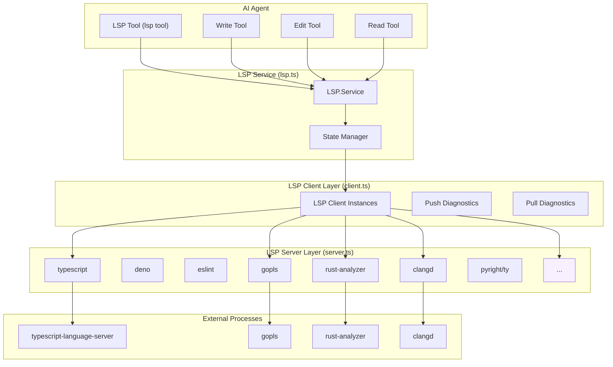
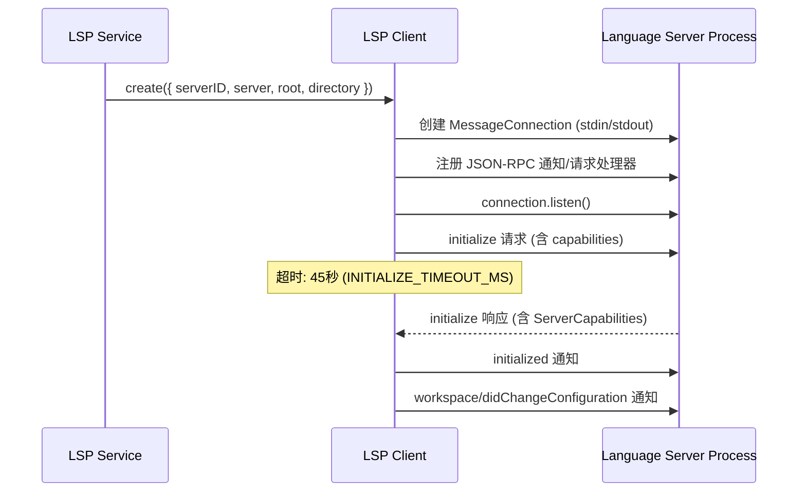
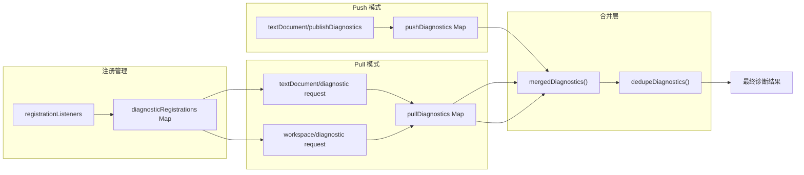
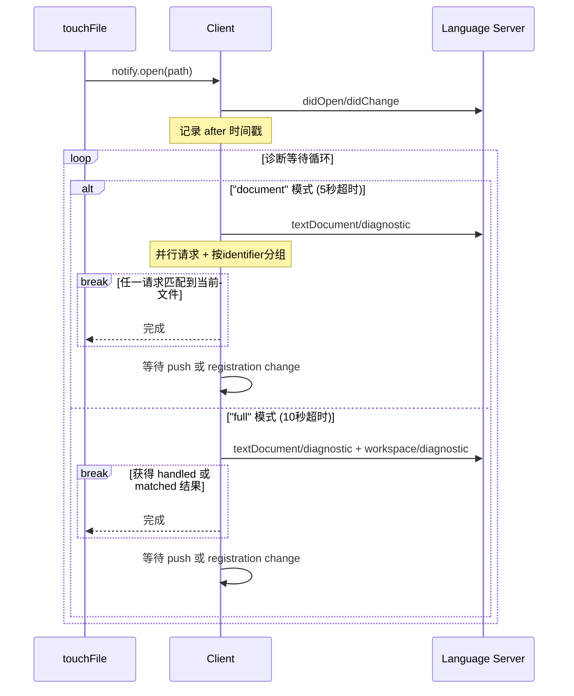
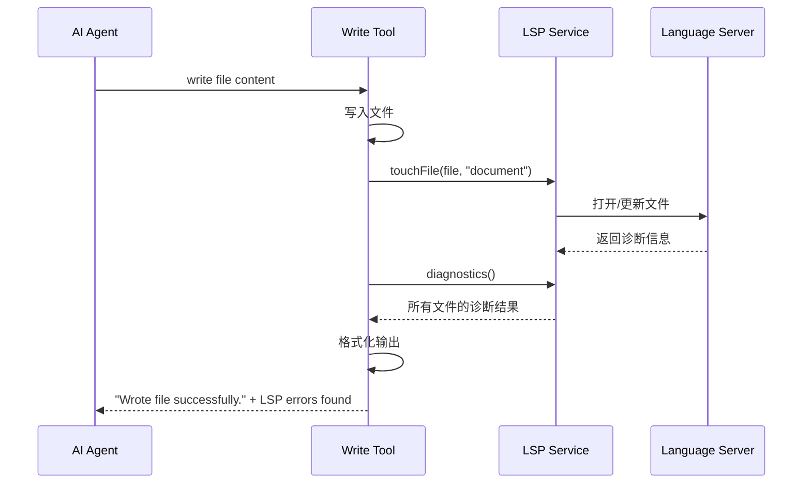
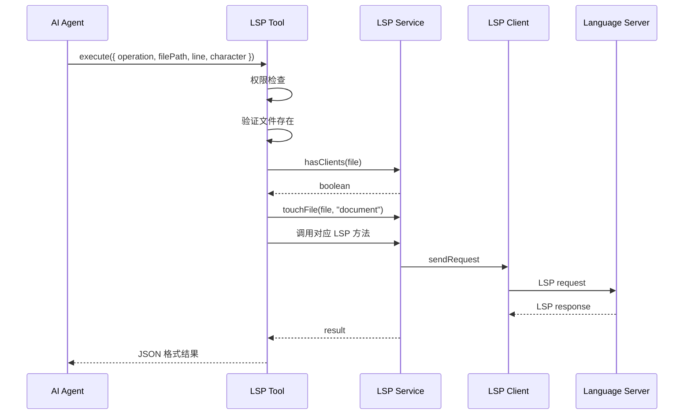
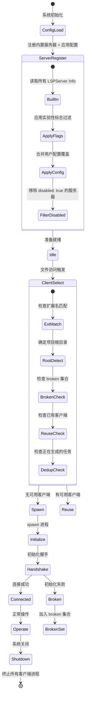
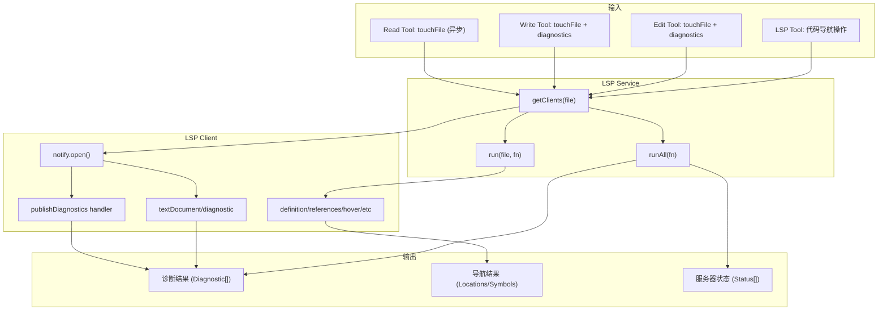

# OpenCode LSP (Language Server Protocol) 集成

## 概述

OpenCode 通过内置的 LSP 客户端框架，与 Language Server Protocol 服务器深度集成，为 AI 编程代理提供代码智能特性。LSP 集成的核心目标是将**诊断信息（diagnostics）**和**代码导航能力**（跳转定义、查找引用、悬停信息等）暴露给 AI Agent，使其能够像人类开发者在 IDE 中一样理解代码结构并发现代码问题。

### 核心能力

- **诊断收集**：从语言服务器收集错误、警告、提示等诊断信息，并在文件编辑后自动反馈给 AI Agent 以便修复
- **代码导航**：通过 LSP 工具提供转到定义、查找引用、符号搜索等能力
- **悬停信息**：获取符号的类型信息和文档
- **调用层次**：支持来电/去电调用关系分析

---

## 架构总览

OpenCode 的 LSP 系统采用 **Effect-TS** 依赖注入框架构建，由以下核心模块组成：



### 源代码文件结构

| 文件 | 行数 | 职责 |
|------|------|------|
| `lsp.ts` | 517 | 主模块：Service 定义、公共 API、状态管理、Effect 层 |
| `client.ts` | 697 | LSP 客户端实现：初始化握手、诊断管理、文档同步 |
| `server.ts` | 2064 | 内置 Language Server 定义：30+ 语言服务器的启动逻辑和根目录检测 |
| `language.ts` | 121 | 文件扩展名到 LSP 语言标识符的映射表 |
| `launch.ts` | 21 | 语言服务器进程 spawn 工具函数 |
| `diagnostic.ts` | 29 | 诊断信息格式化与报告工具 |

---

## LSP Service 公共接口

`LSP.Service` 是系统的主要入口点，通过 Effect 依赖注入提供所有 LSP 功能。其公共接口定义如下：

```typescript
interface Interface {
  readonly init: () => Effect.Effect<void>
  readonly status: () => Effect.Effect<Status[]>
  readonly hasClients: (file: string) => Effect.Effect<boolean>
  readonly touchFile: (input: string, diagnostics?: "document" | "full") => Effect.Effect<void>
  readonly diagnostics: () => Effect.Effect<Record<string, Diagnostic[]>>
  readonly hover: (input: LocInput) => Effect.Effect<any>
  readonly definition: (input: LocInput) => Effect.Effect<any[]>
  readonly references: (input: LocInput) => Effect.Effect<any[]>
  readonly implementation: (input: LocInput) => Effect.Effect<any[]>
  readonly documentSymbol: (uri: string) => Effect.Effect<(DocumentSymbol | Symbol)[]>
  readonly workspaceSymbol: (query: string) => Effect.Effect<Symbol[]>
  readonly prepareCallHierarchy: (input: LocInput) => Effect.Effect<any[]>
  readonly incomingCalls: (input: LocInput) => Effect.Effect<any[]>
  readonly outgoingCalls: (input: LocInput) => Effect.Effect<any[]>
}
```

### LocInput 与位置约定

LSP 协议使用 **0-based** 行号和字符偏移。但在 `LocInput` 中统一使用 0-based 值。上层调用方（如 LSP Tool）负责将 1-based 用户输入转换为 0-based。

---

## 语言检测与 LSP 映射

### 文件扩展名到 Language ID

文件 `language.ts` 维护了一个包含 **100+ 文件扩展名** 到 LSP 标准 language ID 的映射表。这个映射在 `textDocument/didOpen` 通知中设置 `languageId` 字段，帮助语言服务器正确识别文件类型。

代表性映射示例：

| 扩展名 | Language ID |
|--------|------------|
| `.ts`, `.tsx`, `.mts`, `.cts` | typescript / typescriptreact |
| `.go` | go |
| `.rs` | rust |
| `.py` | python |
| `.java` | java |
| `.vue` | vue |
| `.svelte` | svelte |
| `.astro` | astro |
| `.zig`, `.zon` | zig |
| `.nix` | nix |
| `.typ`, `.typc` | typst |

完整映射详见 `language.ts` 中的 `LANGUAGE_EXTENSIONS` 常量。

### 语言服务器选择逻辑

当确定需要为某个文件启动 LSP 客户端时，系统按照以下规则匹配：

1. 提取文件的扩展名（如 `.ts`）
2. 遍历所有已注册的 `LSPServer.Info`，检查 `server.extensions` 是否包含该扩展名
3. 调用 `server.root(file, ctx)` 确定项目根目录
4. 检查该服务器是否已被标记为 `broken`（启动失败的服务器会被加入 break 集合）
5. 如果已有同 root + 同 serverID 的活跃客户端，则复用

---

## LSP 客户端架构

`client.ts` 是 LSP 客户端的核心实现，负责与语言服务器进程建立 JSON-RPC 连接、执行初始化握手、管理文档同步和诊断收集。

### 初始化流程



**Initialize 请求**中包含的关键 capabilities：

- `textDocument.synchronization.didOpen/didChange`: 支持文档打开和修改通知
- `textDocument.diagnostic.dynamicRegistration`: 支持动态注册诊断能力
- `textDocument.publishDiagnostics`: 支持推送式诊断
- `workspace.configuration`: 支持工作区配置请求
- `workspace.didChangeWatchedFiles`: 支持文件变更监视
- `window.workDoneProgress`: 支持进度报告

### 连接处理器

客户端注册了以下 JSON-RPC 处理器：

| 类型 | 方法 | 说明 |
|------|------|------|
| 通知 | `textDocument/publishDiagnostics` | 接收服务器推送的诊断信息（push 模式） |
| 请求 | `window/workDoneProgress/create` | 工作完成进度创建 |
| 请求 | `workspace/configuration` | 服务器请求配置信息（返回 `server.initialization` 设置） |
| 请求 | `client/registerCapability` | 服务器动态注册能力（如 pull diagnostics） |
| 请求 | `client/unregisterCapability` | 服务器动态注销能力 |
| 请求 | `workspace/workspaceFolders` | 返回工作区文件夹信息 |
| 请求 | `workspace/diagnostic/refresh` | 诊断刷新请求 |

### 文档同步

客户端的 `notify.open()` 方法负责将文件内容同步到语言服务器：

1. **首次打开**（文件不在 files 缓存中）：
   - 发送 `workspace/didChangeWatchedFiles`（type: CREATED）
   - 清空该路径的 push 和 pull 诊断缓存
   - 发送 `textDocument/didOpen`（含 languageId、version=0、完整文本）

2. **再次访问**（文件已在 files 缓存中）：
   - 发送 `workspace/didChangeWatchedFiles`（type: CHANGED）
   - 发送 `textDocument/didChange`
   - 根据服务器的 `textDocumentSync` 类型选择变更模式：
     - **增量模式**（syncKind === 2）：发送从 `(0,0)` 到旧文本末尾的 range replacement
     - **全量模式**：发送完整的新文本

3. **注意**：对于已打开的文件，不会清除诊断缓存，因为某些服务器（如 clangd）仅在内容真正变化时才重新发送诊断。如果清除缓存，会导致无操作调用 touchFile 时丢失错误信息。

### 文档同步类型

```typescript
function getSyncKind(capabilities?: ServerCapabilities) {
  if (!capabilities) return
  const sync = capabilities.textDocumentSync
  if (typeof sync === "number") return sync
  return sync?.change
}
```

LSP 规范定义了三种文档同步模式：
- `0` (None): 服务器不关心文档内容
- `1` (Full): 服务器期望完整的文档内容
- `2` (Incremental): 服务器支持增量文档更新

---

## 诊断收集与呈现

OpenCode 的 LSP 诊断系统支持两种收集模式：**推送（Push）**和**拉取（Pull）**，动态适应不同语言服务器的能力。

### 诊断架构



### Push Diagnostics（推送诊断）

推送诊断是传统的 LSP 诊断模式，服务器主动通过 `textDocument/publishDiagnostics` 通知推送诊断信息。

- 数据存储在 `pushDiagnostics` Map 中
- 每次接收到通知时，记录 `published` Map 中的时间戳和版本号
- 特殊优化：TypeScript 服务器（`typescript-language-server`）在首次打开文件时会立即推送一次诊断。为了减少延迟，系统将首次推送**作为种子数据**存入 `pushDiagnostics`，而不是等待 150ms debounce 后的第二次推送

```typescript
function shouldSeedDiagnosticsOnFirstPush(serverID: string) {
  return serverID === "typescript"
}
```

### Pull Diagnostics（拉取诊断）

拉取模式下，客户端主动向服务器请求诊断信息。支持两种请求：

1. **`textDocument/diagnostic`**：单文件诊断拉取
   - 支持按 `identifier` 分组的动态注册

2. **`workspace/diagnostic`**：全工作区诊断拉取
   - 服务器返回多个文件的诊断结果

### 诊断等待策略

当调用 `touchFile` 并指定 `diagnostics` 模式时，客户端会等待服务器返回诊断：



**关键超时配置**：

| 常量 | 值 | 说明 |
|------|------|------|
| `DIAGNOSTICS_DEBOUNCE_MS` | 150ms | 推送诊断去抖延迟 |
| `DIAGNOSTICS_DOCUMENT_WAIT_TIMEOUT_MS` | 5,000ms | 单文件诊断等待超时 |
| `DIAGNOSTICS_FULL_WAIT_TIMEOUT_MS` | 10,000ms | 全量诊断等待超时 |
| `DIAGNOSTICS_REQUEST_TIMEOUT_MS` | 3,000ms | 单次诊断请求超时 |
| `INITIALIZE_TIMEOUT_MS` | 45,000ms | 服务器初始化超时 |

### 诊断去重

所有诊断结果在被返回之前都会经过去重处理：

```typescript
function dedupeDiagnostics(items: Diagnostic[]) {
  const seen = new Set<string>()
  return items.filter((item) => {
    const key = JSON.stringify({
      code: item.code,
      severity: item.severity,
      message: item.message,
      source: item.source,
      range: item.range,
    })
    if (seen.has(key)) return false
    seen.add(key)
    return true
  })
}
```

去重依据：`code`、`severity`、`message`、`source`、`range` 的联合唯一性。

### 诊断格式化

`diagnostic.ts` 提供了诊断信息的可读化格式化：

```typescript
export function pretty(diagnostic: Diagnostic) {
  const severityMap = {
    1: "ERROR",
    2: "WARN",
    3: "INFO",
    4: "HINT",
  }
  const severity = severityMap[diagnostic.severity || 1]
  const line = diagnostic.range.start.line + 1
  const col = diagnostic.range.start.character + 1
  return `${severity} [${line}:${col}] ${diagnostic.message}`
}
```

`report()` 函数将错误级别的诊断信息格式化为 XML 块，每文件最多显示 **20 条** 错误：

```xml
<diagnostics file="/path/to/file.ts">
ERROR [10:5] Type 'string' is not assignable to type 'number'.
ERROR [25:3] Cannot find name 'foo'.
</diagnostics>
```

---

## 与 Write/Edit/Read 工具的集成

LSP 诊断与文件操作工具深度整合，确保 AI Agent 在修改文件后立即获得代码质量问题反馈。

### Write Tool 的诊断反馈



- **当前文件诊断**：如果有错误，在输出中追加 `"LSP errors detected in this file, please fix:"` 并附带格式化的诊断信息
- **项目级诊断**：检测其他文件中的诊断问题，最多显示 `MAX_PROJECT_DIAGNOSTICS_FILES` 个文件的结果

### Edit Tool 的诊断反馈

与 Write Tool 行为类似，但仅显示当前文件的错误：

```
Edit applied successfully.

LSP errors detected in this file, please fix:
<diagnostics file="src/app.ts">
ERROR [15:3] Cannot find name 'unusedVar'.
</diagnostics>
```

### Read Tool 的 LSP 触发

Read Tool 在后台异步调用 `lsp.touchFile(filepath)`，不使用诊断报告，目的是**预热** LSP 服务器，使后续的代码导航操作变得更快。

---

## LSP 工具 (LSP Tool)

LSP Tool 是一个实验性功能，通过 `OPENCODE_EXPERIMENTAL_LSP_TOOL` 标志控制启用。它让 AI Agent 可以直接请求代码智能信息。

### 支持的操作

| 操作 | 对应 LSP 方法 | 说明 |
|------|-------------|------|
| `goToDefinition` | `textDocument/definition` | 查找符号定义位置 |
| `findReferences` | `textDocument/references` | 查找所有引用（含声明） |
| `hover` | `textDocument/hover` | 获取符号悬停信息（类型、文档） |
| `documentSymbol` | `textDocument/documentSymbol` | 获取文档内所有符号 |
| `workspaceSymbol` | `workspace/symbol` | 项目级符号搜索（带过滤） |
| `goToImplementation` | `textDocument/implementation` | 查找接口实现 |
| `prepareCallHierarchy` | `textDocument/prepareCallHierarchy` | 准备调用层次项 |
| `incomingCalls` | `callHierarchy/incomingCalls` | 查找调用者 |
| `outgoingCalls` | `callHierarchy/outgoingCalls` | 查找被调用者 |

### 调用流程



### 参数说明

| 参数 | 类型 | 必需 | 说明 |
|------|------|------|------|
| `operation` | 枚举 | 是 | 要执行的 LSP 操作 |
| `filePath` | string | 是 | 绝对或相对路径（workspaceSymbol 中用于选择 LSP 服务器） |
| `line` | number | 条件必需 | 1-based 行号 |
| `character` | number | 条件必需 | 1-based 字符偏移 |
| `query` | string | 仅 workspaceSymbol | 符号搜索查询字符串，空字符串返回所有符号 |

### 权限模型

LSP Tool 使用统一的权限系统，权限类型为 `"lsp"`，模式匹配 `["*"]`，而 `always: ["*"]` 表示该权限默认允许（不提示用户确认）。每次执行时记录的元数据包含操作类型、文件路径和位置信息。

### workspaceSymbol 符号过滤

`workspace/symbol` 的搜索结果会按照符号类型进行过滤，仅保留以下类型的符号：

- Class / Function / Method / Interface / Variable / Constant / Struct / Enum

每次搜索结果限制为最多 **10 个**符号。

---

## 内置 Language Server 支持

OpenCode 内置了对 **30+ 个语言服务器** 的支持，定义在 `server.ts` 中。每个服务器实现都遵循 `Info` 接口：

```typescript
interface Info {
  id: string          // 服务器唯一标识
  extensions: string[] // 支持的文件扩展名列表
  root: RootFunction  // 确定项目根目录的函数
  spawn(root: string, ctx: InstanceContext): Promise<Handle | undefined>
}
```

### 完整内置服务器列表

#### JavaScript / TypeScript 生态

| 服务器 ID | 文件扩展名 | 项目根检测 | 备注 |
|----------|-----------|-----------|------|
| **typescript** | `.ts`, `.tsx`, `.js`, `.jsx`, `.mjs`, `.cjs`, `.mts`, `.cts` | `package-lock.json`/`bun.lockb`/`pnpm-lock.yaml`/`yarn.lock` | 使用 `typescript-language-server` + 本地 TypeScript |
| **deno** | `.ts`, `.tsx`, `.js`, `.jsx`, `.mjs` | `deno.json`/`deno.jsonc` | 仅在这些项目文件中存在时才启用；与 TypeScript 互斥 |
| **vue** | `.vue` | 包管理器锁文件 | 使用 `vue-language-server` / `@vue/language-server` |
| **eslint** | `.ts`, `.tsx`, `.js`, `.jsx`, `.mjs`, `.cjs`, `.mts`, `.cts`, `.vue` | 包管理器锁文件 | 自动下载并编译 VS Code ESLint 服务器 |
| **oxlint** | `.ts`, `.tsx`, `.js`, `.jsx`, `.mjs`, `.cjs`, `.mts`, `.cts`, `.vue`, `.astro`, `.svelte` | `.oxlintrc.json` 或包管理器文件 | 支持 `oxlint --lsp` 和 `oxc_language_server` |
| **biome** | `.ts`, `.tsx`, `.js`, `.jsx`, `.mjs`, `.cjs`, `.mts`, `.cts`, `.json`, `.jsonc`, `.vue`, `.astro`, `.svelte`, `.css`, `.graphql`, `.gql`, `.html` | `biome.json`/`biome.jsonc` 或包管理器文件 | 启动参数: `lsp-proxy --stdio` |
| **svelte** | `.svelte` | 包管理器锁文件 | 使用 `svelte-language-server` |
| **astro** | `.astro` | 包管理器锁文件 | 使用 `@astrojs/language-server`，需要本地 TypeScript |

#### Go

| 服务器 ID | 文件扩展名 | 项目根检测 | 备注 |
|----------|-----------|-----------|------|
| **gopls** | `.go` | `go.work` > `go.mod`/`go.sum` | 可自动安装：`go install golang.org/x/tools/gopls@latest` |

#### Rust

| 服务器 ID | 文件扩展名 | 项目根检测 | 备注 |
|----------|-----------|-----------|------|
| **rust** (rust-analyzer) | `.rs` | 向上查找 `Cargo.toml`（支持 workspace） | 需要系统已安装 `rust-analyzer`，不支持自动下载 |

#### C / C++

| 服务器 ID | 文件扩展名 | 项目根检测 | 备注 |
|----------|-----------|-----------|------|
| **clangd** | `.c`, `.cpp`, `.cc`, `.cxx`, `.c++`, `.h`, `.hpp`, `.hh`, `.hxx`, `.h++` | `compile_commands.json`/`compile_flags.txt`/`.clangd` | 启动参数: `--background-index --clang-tidy`；支持从 GitHub Releases 自动下载 |

#### C# / .NET

| 服务器 ID | 文件扩展名 | 项目根检测 | 备注 |
|----------|-----------|-----------|------|
| **csharp** | `.cs`, `.csx` | `.slnx`/`.sln`/`.csproj`/`global.json` | 使用 `roslyn-language-server`，可通过 `dotnet tool install` 自动安装 |
| **razor** | `.razor`, `.cshtml` | 同 C# | 需要 VS Code C# 扩展的 Razor 组件 |
| **fsharp** | `.fs`, `.fsi`, `.fsx`, `.fsscript` | `.slnx`/`.sln`/`.fsproj`/`global.json` | 使用 `fsautocomplete`，可通过 `dotnet tool install` 安装 |

#### Python

| 服务器 ID | 文件扩展名 | 项目根检测 | 备注 |
|----------|-----------|-----------|------|
| **pyright** | `.py`, `.pyi` | `pyproject.toml`/`setup.py`/`setup.cfg`/`requirements.txt`/`Pipfile`/`pyrightconfig.json` | 自动检测虚拟环境的 Python 路径；使用 `pyright-langserver --stdio` |
| **ty** | `.py`, `.pyi` | `pyproject.toml`/`ty.toml` 等 + `pyrightconfig.json` | 实验性服务器（`OPENCODE_EXPERIMENTAL_LSP_TY` 启用时替代 pyright） |

#### Ruby

| 服务器 ID | 文件扩展名 | 项目根检测 | 备注 |
|----------|-----------|-----------|------|
| **ruby-lsp** | `.rb`, `.rake`, `.gemspec`, `.ru` | `Gemfile` | 使用 RuboCop 的 LSP 模式 (`rubocop --lsp`)；可自动通过 `gem install` 安装 |

#### Java / Kotlin

| 服务器 ID | 文件扩展名 | 项目根检测 | 备注 |
|----------|-----------|-----------|------|
| **jdtls** | `.java` | `pom.xml` > `build.gradle` > `gradlew` > `settings.gradle` | Eclipse JDT LS；需要 Java 21+；自动从 Eclipse 下载 |
| **kotlin-ls** | `.kt`, `.kts` | `settings.gradle.kts` > `gradlew` > `build.gradle.kts` > `pom.xml` | 从 JetBrains CDN 自动下载 |

#### 其他语言

| 服务器 ID | 文件扩展名 | 项目根检测 | 备注 |
|----------|-----------|-----------|------|
| **elixir-ls** | `.ex`, `.exs` | `mix.exs`/`mix.lock` | 自动从 GitHub 下载并编译（需要 Elixir） |
| **zls** | `.zig`, `.zon` | `build.zig` | Zig 语言服务器；从 GitHub Releases 自动下载 |
| **sourcekit-lsp** | `.swift`, `.objc`, `objcpp` | `Package.swift`/`*.xcodeproj`/`*.xcworkspace` | 通过 `sourcekit-lsp` 或 `xcrun` 查找 |
| **ocaml-lsp** | `.ml`, `.mli` | `dune-project`/`dune-workspace`/`.merlin`/`opam` | OCaml 语言服务器 |
| **dart** | `.dart` | `pubspec.yaml`/`analysis_options.yaml` | Dart 语言服务器 (`dart language-server --lsp`) |
| **julials** | `.jl` | `Project.toml`/`Manifest.toml` | Julia 语言服务器 |
| **haskell-language-server** | `.hs`, `.lhs` | `stack.yaml`/`cabal.project`/`hie.yaml`/`*.cabal` | 通过 `haskell-language-server-wrapper --lsp` |
| **clojure-lsp** | `.clj`, `.cljs`, `.cljc`, `.edn` | `deps.edn`/`project.clj`/`shadow-cljs.edn`/`bb.edn`/`build.boot` | Clojure 语言服务器 |
| **bash** | `.sh`, `.bash`, `.zsh`, `.ksh` | 实例目录 | 使用 `bash-language-server start` |
| **yaml-ls** | `.yaml`, `.yml` | 包管理器锁文件 | YAML 语言服务器 |
| **lua-ls** | `.lua` | `.luarc.json`/`.luacheckrc`/`.stylua.toml`/`selene.toml` | Lua 语言服务器；从 GitHub Releases 自动下载 |
| **php intelephense** | `.php` | `composer.json`/`composer.lock`/`.php-version` | PHP Intelephense |
| **prisma** | `.prisma` | `schema.prisma` | Prisma 语言服务器 |
| **terraform** | `.tf`, `.tfvars` | `.terraform.lock.hcl`/`terraform.tfstate`/`*.tf` | Terraform LS；从 HashiCorp Releases 自动下载 |
| **texlab** | `.tex`, `.bib` | `.latexmkrc`/`.texlabroot` | LaTeX 语言服务器；从 GitHub Releases 自动下载 |
| **dockerfile** | `.dockerfile`, `Dockerfile`（文件名匹配） | 实例目录 | Dockerfile 语言服务器 |
| **gleam** | `.gleam` | `gleam.toml` | Gleam 语言服务器 |
| **nixd** | `.nix` | `flake.nix` > git 仓库根 > 实例目录 | Nix 语言服务器 |
| **tinymist** | `.typ`, `.typc` | `typst.toml` | Typst 语言服务器；从 GitHub Releases 自动下载 |

### 项目根目录检测机制

每个语言服务器通过 `RootFunction` 确定项目根目录，核心工具是 `NearestRoot` 函数：

```typescript
const NearestRoot = (includePatterns: string[], excludePatterns?: string[]): RootFunction => {
  return async (file, ctx) => {
    // 1. 如果是排除模式，检查从文件到实例目录的路径中是否存在排除文件
    // 2. 使用 Filesystem.up 从文件所在目录向上查找 includePatterns
    // 3. 如果找到匹配文件，返回其所在目录作为根目录
    // 4. 如果未找到，返回实例目录 (ctx.directory)
  }
}
```

**关键设计**：
- 搜索范围限制在 `ctx.directory`（实例目录）内，不会超出项目边界
- 部分服务器（如 Java/Kotlin）使用多阶段检测：先尝试子项目标记，再尝试 monorepo 根标记
- 部分服务器（如 C#）搜索多个文件类型，按优先级排列

### 语言服务器互斥

某些语言服务器之间存在互斥关系：

- **TypeScript** 和 **Deno**：Deno 使用独立的 LSP 实现。通过排除模式，当检测到 `deno.json` 或 `deno.jsonc` 时，TypeScript 服务器不会在该目录下启动
- **pyright** 和 **ty**：当 `OPENCODE_EXPERIMENTAL_LSP_TY` 标志启用时，ty 替代 pyright

### 自动下载机制

许多语言服务器支持**从远程源自动下载**（默认启用）。服务器实现遵循统一的下载模式：

1. 首先检查系统 PATH 中是否已有该工具
2. 如果未找到，检查项目本地（`node_modules/.bin` 等）
3. 如果仍未找到且 `OPENCODE_DISABLE_LSP_DOWNLOAD` 标志未设置，从远程下载
4. 下载后自动解压/安装，并设置可执行权限

**对于 npm 包**：使用内部 `Npm.which()` 解析，支持 npx 风格的临时执行
**对于 Go 工具**：使用 `go install` 安装到 `Global.Path.bin`
**对于 .NET 工具**：使用 `dotnet tool install` 安装
**对于 GitHub Releases**：通过 GitHub API 选择正确的平台/架构构建，下载并解压

支持自动下载的服务器：clangd、elixir-ls、eslint、jdtls、kotlin-ls、lua-ls、gopls、rubocop、terraform-ls、texlab、tinymist、zls 等。

---

## 配置 (opencode.json)

LSP 集成通过 `opencode.json` 中的 `lsp` 字段进行配置，定义在 `config/lsp.ts` 中。

### 配置模式

```typescript
type LSPConfig = boolean | Record<string, LSPEntry>

type LSPEntry = 
  | { disabled: true }
  | {
      command: string[]            // 启动命令和参数
      extensions?: string[]        // 支持的文件扩展名（自定义服务器必需）
      disabled?: boolean           // 是否禁用
      env?: Record<string, string> // 额外环境变量
      initialization?: Record<string, unknown> // 初始化选项
    }
```

### 配置示例

**启用所有内置服务器**：
```json
{
  "lsp": true
}
```

**禁用所有 LSP 功能**：
```json
{
  "lsp": false
}
```

**禁用特定内置服务器**：
```json
{
  "lsp": {
    "eslint": { "disabled": true },
    "oxlint": { "disabled": true }
  }
}
```

**自定义语言服务器**：
```json
{
  "lsp": {
    "my-custom-lsp": {
      "command": ["my-lang-server", "--stdio", "--custom-flag"],
      "extensions": [".mylang", ".myl"],
      "env": {
        "MY_LANG_CONFIG": "/path/to/config"
      },
      "initialization": {
        "enableFeature": true
      }
    }
  }
}
```

**覆盖内置服务器配置**：
```json
{
  "lsp": {
    "clangd": {
      "command": ["/usr/local/bin/clangd-19", "--background-index", "--clang-tidy"],
      "extensions": [".c", ".cpp", ".h", ".hpp"]
    }
  }
}
```

### 配置验证

系统包含一个配置验证器 `requiresExtensionsForCustomServers`，确保自定义（非内置）服务器必须指定 `extensions` 数组。如果未指定，配置将无法通过验证。

---

## 服务器生命周期管理

### 状态模型

LSP Service 维护的核心状态：

```typescript
interface State {
  clients: LSPClient.Info[]                     // 活跃客户端列表
  servers: Record<string, LSPServer.Info>       // 注册的服务器定义
  broken: Set<string>                           // 启动失败的服务器（root + serverID）
  spawning: Map<string, Promise<...>>           // 正在生成的客户端
}
```

### 生命周期流程



### 客户端调度与去重

当多个文件请求访问同一服务器的同一根目录时，系统使用 `spawning` Map 确保不会重复创建客户端：

1. 检查是否有现有的活跃客户端（root + serverID 匹配）
2. 检查是否有正在进行的生成任务（`spawning.get(root + server.id)`）
3. 如果都没有，创建新的生成任务并注册到 `spawning` Map
4. 任务完成后，从 `spawning` Map 中移除
5. 如果发现已有客户端且当前任务已生成新进程，停止新进程（`await Process.stop(handle.process)`）

### 错误恢复

- **启动失败**：服务器 root + serverID 被加入 `broken` 集合，后续该组合不会再被尝试
- **初始化失败**：捕获 `InitializeError`、停止进程、记录错误日志，加入 `broken` 集合
- **日志记录**：通过 `Log.create({ service: "lsp" })` 和 `"lsp.client"` 标记，所有操作均有日志可追溯

### 系统关闭

在 Effect 的 finalizer 中，所有活跃客户端会被依次关闭：

```typescript
yield* Effect.addFinalizer(() =>
  Effect.promise(async () => {
    await Promise.all(s.clients.map((client) => client.shutdown()))
  }),
)
```

每个客户端的 `shutdown()` 方法：
- 调用 `connection.end()` 和 `connection.dispose()` 关闭 JSON-RPC 连接
- 调用 `Process.stop(input.server.process)` 终止子进程

---

## 实验性功能标志

| 标志 | 作用 |
|------|------|
| `OPENCODE_EXPERIMENTAL_LSP_TOOL` | 启用 LSP 工具（允许 Agent 调用代码导航操作） |
| `OPENCODE_EXPERIMENTAL_LSP_TY` | 启用 `ty` Python 语言服务器（替代 `pyright`） |
| `OPENCODE_DISABLE_LSP_DOWNLOAD` | 禁用语言服务器的自动下载功能 |

---

## 数据流总结



---

## 关键设计决策

1. **双重诊断模式（Push + Pull）**：同时支持传统的推送式诊断和现代的拉取式诊断（LSP 3.17+），自动适应不同服务器的能力。服务器可通过 `client/registerCapability` 动态注册拉取能力。

2. **延迟加载**：LSP 客户端仅在文件被访问时才创建，而非启动时一次性创建所有客户端。这减少了资源占用，并允许系统根据实际需要启动服务。

3. **TypeScript 首次推送优化**：TypeScript 语言服务器在文件首次打开时会立即推送诊断。系统通过 `shouldSeedDiagnosticsOnFirstPush` 将首次推送作为种子数据，避免了等待 150ms debounce 的额外延迟。

4. **诊断去重**：由于同时存在 push 和 pull 两种来源，诊断信息可能重复。系统使用 JSON 序列化的诊断键进行去重。

5. **Parallel 快速路径**：`requestDocumentDiagnostics` 中的拉取请求完全并行分发，不按 identifier 串行化，一旦任一请求返回当前文件的诊断就立即返回，后续结果继续在后台合并。这是对单文件操作延迟的关键优化。

6. **互斥服务器自动切换**：TypeScript/Deno 和 pyright/ty 的互斥关系通过 `NearestRoot` 的排除模式自动处理，无需用户手动配置。

7. **服务器进程 stderr 处理**：一些语言服务器（如 clangd）在 stderr 输出常规信息。系统将 stderr 降级为 debug 日志级别（可通过 `--print-logs --log-level DEBUG` 启用），避免污染正常日志输出。
