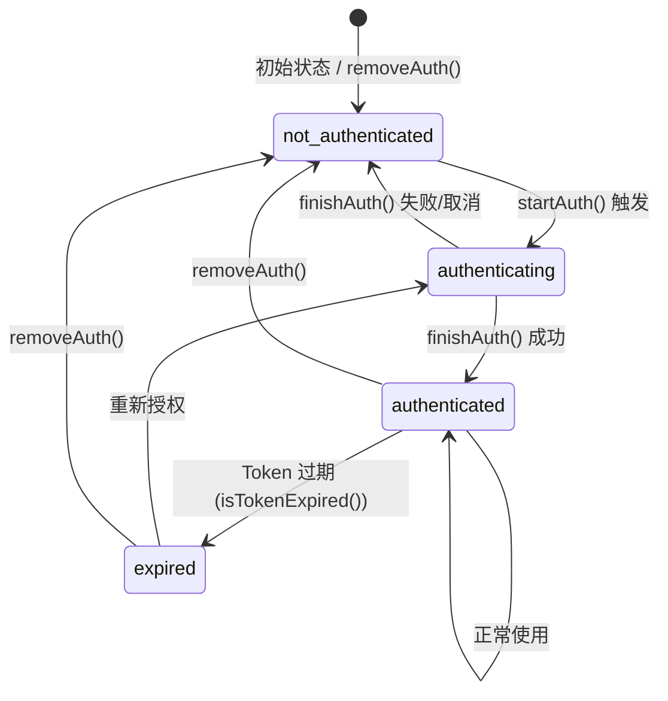

# MCP (Model Context Protocol) 系统文档

MCP 是 OpenCode 的多服务器模型上下文协议集成层，允许 AI 代理发现并调用外部工具、获取提示词模板、读取资源，同时支持 OAuth 认证、远程（HTTP）和本地（stdio）两种传输方式。

---

## 1. 架构概览

```
+-------------------------------------------------------------------+
|                         OpenCode MCP Layer                         |
|                                                                   |
|   +------------------------------------------------------------+  |
|   |                    MCP Service (Effect)                     |  |
|   |                                                            |  |
|   |  status()  clients()  tools()  prompts()  resources()      |  |
|   |  add()  connect()  disconnect()                            |  |
|   |  getPrompt()  readResource()                               |  |
|   |  startAuth()  authenticate()  finishAuth()  removeAuth()   |  |
|   +------------------------------------------------------------+  |
|                              |                                     |
|         +--------------------+--------------------+                |
|         |                    |                    |                |
|  +------v-------+   +-------v--------+   +------v-------+         |
|  | Remote       |   | Local          |   | Auth          |         |
|  | Transport    |   | Transport      |   | Manager       |         |
|  |              |   |                |   |               |         |
|  | Streamable   |   | StdioClient    |   | McpOAuth      |         |
|  | HTTP Client  |   | Transport      |   | Provider      |         |
|  | (preferred)  |   |                |   |               |         |
|  |              |   | command + args |   | OAuth         |         |
|  | SSE Client   |   | + env vars     |   | Callback      |         |
|  | (fallback)   |   |                |   | Server        |         |
|  +--------------+   +----------------+   +---------------+         |
|                                                                   |
|  +------------------------------------------------------------+  |
|  |              McpAuth (Persistent Storage)                    |  |
|  |              ~/.local/share/opencode/mcp-auth.json           |  |
|  +------------------------------------------------------------+  |
|                                                                   |
|  +------------------------------------------------------------+  |
|  |              Tool Change Watcher                             |  |
|  |     ToolListChangedNotification -> re-fetch -> bus event     |  |
|  +------------------------------------------------------------+  |
+-------------------------------------------------------------------+
```

### 核心组件

| 组件 | 文件路径 | 职责 |
|------|---------|------|
| **MCP Service** | `src/mcp/index.ts` | 主体服务，管理连接生命周期、工具转换、暴露所有对外接口 |
| **McpAuth** | `src/mcp/auth.ts` | 认证凭据持久化存储（Token、ClientInfo、CodeVerifier、OAuthState） |
| **McpOAuthProvider** | `src/mcp/oauth-provider.ts` | 实现 MCP SDK 的 OAuthClientProvider 接口，桥接 OAuth 流程与本地存储 |
| **McpOAuthCallback** | `src/mcp/oauth-callback.ts` | 本地 HTTP 回调服务器，接收授权码并渲染成功/失败页面 |
| **ConfigMCP** | `src/config/mcp.ts` | MCP 配置类型定义（Local/Remote 服务器配置 Schema） |

---

## 2. MCP 服务接口（Interface）

MCP Service 是一个 Effect 服务，向外暴露以下所有方法：

| 方法 | 签名 | 说明 |
|------|------|------|
| `status()` | `Effect<Record<string, Status>>` | 获取所有 MCP 服务器的连接状态 |
| `clients()` | `Effect<Record<string, MCPClient>>` | 获取所有活跃的 MCP 客户端实例 |
| `tools()` | `Effect<Record<string, Tool>>` | 获取所有已连接服务器的工具列表（转换为 AI SDK Tool 格式） |
| `prompts()` | `Effect<Record<string, PromptInfo & {client}>>` | 获取所有已连接服务器的提示词模板 |
| `resources()` | `Effect<Record<string, ResourceInfo & {client}>>` | 获取所有已连接服务器的资源列表 |
| `add(name, mcp)` | `Effect<{status}>` | 动态添加并连接一个新的 MCP 服务器 |
| `connect(name)` | `Effect<void>` | 启用并连接一个已配置的 MCP 服务器 |
| `disconnect(name)` | `Effect<void>` | 断开指定服务器连接 |
| `getPrompt(clientName, name, args?)` | `Effect<GetPromptResult \| undefined>` | 从指定服务器获取一个具体提示词 |
| `readResource(clientName, uri)` | `Effect<ReadResourceResult \| undefined>` | 从指定服务器读取一个具体资源 |
| `startAuth(mcpName)` | `Effect<{authorizationUrl, oauthState}>` | 启动 OAuth 授权流程，返回授权 URL |
| `authenticate(mcpName)` | `Effect<Status>` | 完整 OAuth 流程：启动 + 打开浏览器 + 等待回调 + 完成授权 |
| `finishAuth(mcpName, code)` | `Effect<Status>` | 使用授权码完成 OAuth 流程 |
| `removeAuth(mcpName)` | `Effect<void>` | 移除服务器存储的 OAuth 凭据 |
| `supportsOAuth(mcpName)` | `Effect<boolean>` | 检查服务器是否支持 OAuth（remote 且 oauth !== false） |
| `hasStoredTokens(mcpName)` | `Effect<boolean>` | 检查是否有已存储的 Token |
| `getAuthStatus(mcpName)` | `Effect<AuthStatus>` | 获取认证状态 |

### 内部状态结构

```typescript
interface State {
  status: Record<string, Status>      // 每个服务器的连接状态
  clients: Record<string, MCPClient>  // 活跃的 MCP 客户端实例
  defs: Record<string, MCPToolDef[]>  // 每个服务器的工具定义缓存
}
```

---

## 3. MCP 状态类型

五种连接状态由 Schema 定义，以 `status` 字段作为区分子（discriminator）：

```
                    +-----------+
                    |  初始状态   |
                    +-----+-----+
                          |
          +---------------+---------------+
          |               |               |
     enabled=false    type=remote     type=local
          |               |               |
          v               v               v
   +-----------+   +-----------+   +-----------+
   | disabled  |   | connected |   | connected |
   +-----------+   | failed    |   | failed    |
                   | needs_auth|   +-----------+
                   | needs_    |
                   | client_   |
                   | registration|
                   +-----------+
```

| 状态 | 含义 |
|------|------|
| `connected` | 成功连接，工具已获取并缓存 |
| `disabled` | 服务器在配置中被禁用（`enabled: false`） |
| `failed` | 连接失败，携带错误信息 |
| `needs_auth` | 服务器需要 OAuth 认证，传输层已保存待后续完成 |
| `needs_client_registration` | 服务器不支持动态客户端注册，需要预注册 clientId |

---

## 4. 连接流程

### 4.1 总体启动流程

```
config.mcp 配置
      |
      v
forEach entry in config.mcp:
      |
      +---> 检查 isMcpConfigured(entry) --> 必须有 "type" 字段
      |
      +---> enabled === false?
      |       YES --> status[key] = "disabled" (断开连接)
      |       NO  --> create(key, mcp)
      |
      +---> create():
              |
              +---> type === "remote"? --> connectRemote()
              +---> type === "local"?  --> connectLocal()
              |
              +---> 连接成功?
              |     YES --> defs(key, client) 获取工具列表
              |              --> 存入 state.clients[key] 和 state.defs[key]
              |              --> watch() 注册工具变更通知
              |     NO  --> 返回失败状态
```

### 4.2 远程连接流程（connectRemote）

```
            connectRemote(key, mcp)
                    |
                    v
            解析 URL: remoteURL(key, mcp.url)
                    |
                    v (URL 无效则返回 failed)
            创建 McpOAuthProvider?
                    |
          oauth !== false --> 创建 authProvider
          oauth === false --> authProvider = undefined
                    |
                    v
            构建传输层列表:
              [0] StreamableHTTPClientTransport (优先)
              [1] SSEClientTransport (回退)
                    |
                    v
            for each transport:
                    |
                    +---> connectTransport(transport, timeout)
                    |
                    +---> 成功?
                    |     YES --> 返回 { client, status: "connected" }
                    |
                    +---> 失败?
                          |
                          +---> UnauthorizedError / OAuth 错误?
                          |     |
                          |     +---> 包含 "registration"/"client_id"?
                          |     |     YES --> 存储错误信息, 发布 Toast 通知,
                          |     |            返回 needs_client_registration, 停止尝试其他传输
                          |     |     NO  --> 存储 transport, 发布 Toast 通知,
                          |     |            返回 needs_auth, 停止尝试其他传输
                          |     |
                          |     +---> 普通错误 --> 记录日志, 继续尝试下一个传输
                          |
                          +---> 不是 auth 错误 --> 继续尝试下一个传输
                    |
                    v
            所有传输都失败 --> 返回 { status: "failed" }
```

**关键实现细节：**

- 总是先尝试 StreamableHTTP，失败后回退到 SSE
- 如果是认证错误（UnauthorizedError 或消息包含 "OAuth"），立即停止尝试其他传输——因为对相同服务器的不同传输层会触发相同的 OAuth 流程
- 当检测到 `needs_client_registration` 时，意味着服务器不支持 RFC 7591 动态客户端注册，用户必须在配置中提供 `clientId`
- Sends user-facing Toast notifications for auth-required states

### 4.3 本地连接流程（connectLocal）

```
            connectLocal(key, mcp)
                    |
                    v
            解析 command + args:
              const [cmd, ...args] = mcp.command
                    |
                    v
            构建 StdioClientTransport:
              {
                stderr: "pipe",       // stderr 转发到日志
                command: cmd,
                args,
                cwd: InstanceState.directory,
                env: {
                  ...process.env,     // 继承当前进程环境
                  ...(cmd === "opencode" ? { BUN_BE_BUN: "1" } : {}),
                  ...mcp.environment  // 用户自定义环境变量
                }
              }
                    |
                    v
            注册 stderr 日志转发:
              transport.stderr.on("data", (chunk) => {
                log.info(`mcp stderr: ${chunk}`, { key })
              })
                    |
                    v
            connectTransport(transport, timeout)
                    |
                    +---> 成功 --> { client, status: "connected" }
                    +---> 失败 --> { status: "failed", error: message }
```

**进程管理：**
- 使用 Effect 的 `ChildProcessSpawner` 服务启动子进程
- `BUN_BE_BUN` 环境变量：当命令是 `opencode` 时，设置此变量以确保子进程以 Bun 运行时启动
- 通过 `pgrep -P <pid>` 递归查找所有后代进程，在关闭时一并终止

---

## 5. 传输层连接与资源安全

`connectTransport` 是所有传输层连接的核心函数，使用 Effect 的 `acquireUseRelease` 模式保证资源安全：

```
connectTransport(transport, timeout)
        |
        v
  Effect.acquireUseRelease(
    // acquire: 直接返回 transport（已创建）
    Effect.succeed(transport),
    |
    // use: 创建 Client 并连接
    (transport) => {
      const client = new Client({
        name: "opencode",
        version: InstallationVersion
      })
      return withTimeout(
        client.connect(transport),
        timeout
      ).then(() => client)
    },
    |
    // release: 仅在失败时关闭 transport
    (transport, exit) => {
      if (Exit.isFailure(exit)) {
        Effect.tryPromise(() => transport.close())
      }
      // 成功时不做操作，调用者接管 transport 生命周期
    }
  )
```

**资源安全的三个保障：**
1. **连接成功**：调用者获得 Client 所有权，transport 在最终清理阶段关闭
2. **连接失败**：transport 在 release 阶段立即关闭，防止资源泄漏
3. **最终清理**：程序退出时，所有活跃 Client 的 transport 都会被关闭

---

## 6. OAuth 认证流程

### 6.1 组件协作图

```
+------------------+       +-------------------+       +------------------+
|   MCP Service    |       |  McpOAuthProvider  |       | McpOAuthCallback |
|   (index.ts)     |       |  (oauth-provider)  |       | (oauth-callback) |
+--------+---------+       +---------+---------+       +--------+---------+
         |                           |                          |
         | 1. startAuth()            |                          |
         |-------------------------->|                          |
         |                           |                          |
         | 2. create transport       |                          |
         |    connect()              |                          |
         |-------------------------->|                          |
         |                           |                          |
         | 3. redirectToAuthorization|                          |
         |<--------------------------|                          |
         |                           |                          |
         | 4. open browser           |                          |
         |-------------------------->|                          |
         |                           |                          |
         |                           |   5. OAuth server        |
         |                           |      redirects user      |
         |                           |      to callback URL     |
         |                           |                          |
         |                           |             6. user-agent|
         |                           |                calls     |
         |                           |            /mcp/oauth/   |
         |                           |             callback     |
         |                           |              +------->   |
         |                           |                          |
         | 7. waitForCallback()      |                          |
         |    returns code           |                          |
         |<-----------------------------------------------------+
         |                           |                          |
         | 8. finishAuth(code)       |                          |
         |-------------------------->|                          |
         |    transport.finishAuth() |                          |
         |<--------------------------|                          |
         |                           |                          |
         | 9. saveTokens()           |                          |
         |<--------------------------|                          |
         |                           |                          |
  +------v-------+                   |                          |
  |   McpAuth    |                   |                          |
  |   (auth.ts)  |<--- write JSON ---+                          |
  +--------------+                                              |
```

### 6.2 startAuth — 启动授权

```
  startAuth(mcpName)
        |
        +---> 验证配置: type === "remote" 且 oauth !== false
        +---> 启动回调服务器: McpOAuthCallback.ensureRunning(redirectUri)
        +---> 生成 oauthState: crypto.getRandomValues(32 bytes) -> hex string
        +---> 保存 oauthState 到 McpAuth 存储
        +---> 创建 McpOAuthProvider (带 onRedirect 回调捕获 authorizationUrl)
        +---> 创建 StreamableHTTPClientTransport
        +---> 尝试连接:
              |
              +---> 连接成功? (无需 OAuth)
              |     --> 返回 { authorizationUrl: "", oauthState, client }
              |
              +---> UnauthorizedError 且捕获到 url?
                    --> 存储 transport 到 pendingOAuthTransports
                    --> 返回 { authorizationUrl, oauthState }
```

### 6.3 authenticate — 完整授权（用户一键触发）

```
  authenticate(mcpName)
        |
        +---> startAuth(mcpName)
              |
              +---> 无需 OAuth 的服务器（直接连接成功）?
              |     --> 获取工具列表 --> storeClient() --> 返回 connected
              |
              +---> 需要 OAuth:
                    |
                    +---> 打开浏览器: open(authorizationUrl)
                    |     (失败时发布 BrowserOpenFailed 事件，用户可手动打开)
                    |
                    +---> 等待回调: McpOAuthCallback.waitForCallback(state, mcpName)
                    |     (超时 5 分钟)
                    |
                    +---> 收到 authorization code
                    |
                    +---> CSRF 防护: 验证存储的 oauthState === 请求中的 state
                    |
                    +---> finishAuth(mcpName, code)
```

### 6.4 finishAuth — 完成授权

```
  finishAuth(mcpName, authorizationCode)
        |
        +---> 从 pendingOAuthTransports 获取传输层
        +---> transport.finishAuth(authorizationCode):
        |     --> 用 code 交换 token
        |     --> McpOAuthProvider.saveTokens() 写入 McpAuth 存储
        |     --> 清理 codeVerifier
        +---> 清理 pendingOAuthTransports
        +---> createAndStore(mcpName, mcpConfig):
              --> 重新创建连接
              --> 获取工具列表
              --> 存储客户端和工具定义
              --> 注册工具变更监听
        +---> 返回最终连接状态
```

### 6.5 OAuth 状态机



### 6.6 OAuth 凭据存储

凭据存储在 `~/.local/share/opencode/mcp-auth.json`（权限 0o600），结构如下：

```json
{
  "server-name": {
    "tokens": {
      "accessToken": "...",
      "refreshToken": "...",
      "expiresAt": 1700000000,
      "scope": "read write"
    },
    "clientInfo": {
      "clientId": "...",
      "clientSecret": "...",
      "clientIdIssuedAt": 1699900000,
      "clientSecretExpiresAt": 1700500000
    },
    "codeVerifier": "...",
    "oauthState": "...",
    "serverUrl": "https://mcp.example.com"
  }
}
```

**动态客户端注册支持：**
- 如果配置中未提供 `clientId`，McpOAuthProvider 返回 `undefined`
- MCP SDK 会自动触发 RFC 7591 动态客户端注册
- 注册成功后，`clientInfo` 通过 `saveClientInformation()` 持久化
- 重新连接时 `getForUrl()` 会验证 `serverUrl` 匹配，防止凭证混用

---

## 7. 工具发现与转换

### 7.1 工具列表获取（listTools / defs）

```
  listTools(key, client, timeout)
        |
        +---> client.listTools(undefined, { timeout })
        |     (使用 MCP 协议请求 "tools/list")
        |
        +---> 成功?
        |     YES --> 返回 tools 数组
        |
        +---> 失败?
              |
              +---> outputSchema 验证错误?
              |     (regex: /can't resolve reference|resolves to more than one schema|
              |            outputSchema|schema.*reference|reference.*schema/i)
              |     |
              |     YES --> 降级重试: client.request("tools/list", TolerantListToolsResultSchema)
              |              使用宽松 Schema 跳过 outputSchema 验证
              |
              +---> 其他错误 --> 失败
```

**Schema 容错机制：**
某些 MCP 服务器的 `outputSchema` 包含无法解析的 `$ref` 引用或存在多个 Schema 定义，导致 Zod 验证失败。系统检测到此类错误后会自动回退到宽松 Schema（`TolerantListToolsResultSchema`），仅验证 `name`、`description`、`inputSchema` 字段，跳过 `outputSchema` 验证。

### 7.2 工具转换（convertMcpTool）

```
  convertMcpTool(mcpTool, client, timeout)
        |
        +---> 提取 inputSchema
        +---> 构建 JSONSchema7:
              {
                type: "object",                    // 强制顶层类型为 object
                properties: inputSchema.properties,
                additionalProperties: false        // 不允许额外属性
              }
        |
        +---> 创建 dynamicTool (AI SDK):
              {
                description: mcpTool.description ?? "",
                inputSchema: jsonSchema(schema),
                execute: (args) =>
                  client.callTool(
                    { name, arguments: args },
                    CallToolResultSchema,
                    {
                      resetTimeoutOnProgress: true,  // 每次进度更新重置超时
                      timeout
                    }
                  )
              }
```

**工具命名规则：**
工具在 AI SDK 中的 key 为 `sanitize(clientName) + "_" + sanitize(mcpTool.name)`，sanitize 规则为 `s.replace(/[^a-zA-Z0-9_-]/g, "_")`。

例如，`server-name` 的工具 `get-weather` 将变为 key `server_name_get-weather`。

### 7.3 工具变更监听

```
  watch(state, name, client, bridge, timeout)
        |
        +---> client.setNotificationHandler(
                ToolListChangedNotificationSchema,
                async () => {
                  |
                  +---> 检查客户端是否仍在连接状态
                  |
                  +---> defs(name, client, timeout) 重新获取工具列表
                  |
                  +---> 再次检查 (防止竞态: 可能在获取期间断开)
                  |
                  +---> 更新 state.defs[name]
                  |
                  +---> bus.publish(ToolsChanged, { server: name })
                        (通知系统工具列表已变更)
                }
              )
```

---

## 8. 提示词与资源

### 8.1 批量获取（prompts / resources）

```
  collectFromConnected(state, listFn, label)
        |
        +---> 遍历所有 connected 状态的客户端
        |
        +---> 对每个客户端:
              fetchFromClient(clientName, client, listFn, label)
              |
              +---> 调用 listFn (listPrompts 或 listResources)
              +---> 为每个条目添加 client 字段标识来源
              +---> key 格式: "sanitizedClient:sanitizedName"
              +---> 失败时返回 undefined (不阻塞其他客户端)
        |
        +---> 合并所有客户端的结果为 Record<string, T & { client }>
```

### 8.2 单项获取（getPrompt / readResource）

```
  withClient(clientName, fn, label, meta)
        |
        +---> 从 state.clients 获取指定客户端
        +---> 客户端不存在? --> 返回 undefined
        +---> 调用 fn(client)，带错误处理和日志
```

---

## 9. 资源清理与生命周期

### 9.1 单个客户端关闭（closeClient）

```
  closeClient(state, name)
        |
        +---> 删除 state.defs[name]
        +---> 客户端不存在? --> Effect.void
        +---> client.close() 关闭连接
```

### 9.2 全局最终清理（addFinalizer）

程序退出时，MCP Service 注册的 finalizer 会执行：

```
  清理流程:
        |
        +---> for each client in state.clients:
              |
              +---> 是 StdioClientTransport 且 pid 是数字?
              |     YES --> descendants(pid): 通过 pgrep -P 递归查找子进程
              |              --> for each child pid:
              |                   process.kill(dpid, "SIGTERM")
              |
              +---> client.close()
        |
        +---> pendingOAuthTransports.clear()
```

**关键点：**
- 本地 MCP 服务器：递归终止整个进程树，防止孤儿进程
- 远程 MCP 服务器：调用 `client.close()` 关闭 HTTP/SSE 连接
- Windows 平台：跳过 `pgrep` 进程树查找（不支持）

### 9.3 生命周期图

```
  +-----------+      +------------+      +------------+
  | 创建 State | ---> | 逐个连接    | ---> | watch()   |
  |           |      | 服务器      |      | 工具变更    |
  +-----------+      +------------+      +------------+
                                              |
                                    程序运行中（正常使用）
                                              |
                                     +--------v--------+
                                     | addFinalizer()   |
                                     | 注册清理回调      |
                                     +--------+---------+
                                              |
                                    程序退出信号 / Layer 销毁
                                              |
                                     +--------v--------+
                                     | 终止所有子进程    |
                                     | close() 所有客户端 |
                                     | 清理 pending 传输 |
                                     +-----------------+
```

---

## 10. 配置示例

### 10.1 远程 HTTP MCP 服务器

```jsonc
{
  "mcp": {
    "weather": {
      "type": "remote",
      "url": "https://weather-mcp.example.com",
      "enabled": true,
      "timeout": 10000,
      "headers": {
        "X-API-Key": "your-api-key-here"
      }
    }
  }
}
```

### 10.2 带 OAuth 的远程服务器

```jsonc
{
  "mcp": {
    "github": {
      "type": "remote",
      "url": "https://mcp.github.com",
      "oauth": {
        "scope": "repo user",
        "redirectUri": "http://127.0.0.1:19876/mcp/oauth/callback"
      }
    }
  }
}
```

**预注册客户端 ID（服务器不支持动态注册时）：**

```jsonc
{
  "mcp": {
    "enterprise-api": {
      "type": "remote",
      "url": "https://mcp.enterprise.com",
      "oauth": {
        "clientId": "your-pre-registered-client-id",
        "clientSecret": "your-client-secret"
      }
    }
  }
}
```

**禁用 OAuth 自动检测：**

```jsonc
{
  "mcp": {
    "no-auth-service": {
      "type": "remote",
      "url": "https://mcp.noauth.com",
      "oauth": false
    }
  }
}
```

### 10.3 本地 stdio MCP 服务器

```jsonc
{
  "mcp": {
    "filesystem": {
      "type": "local",
      "command": ["npx", "-y", "@modelcontextprotocol/server-filesystem", "/path/to/allowed/dir"],
      "enabled": true,
      "timeout": 15000,
      "environment": {
        "NODE_ENV": "production",
        "LOG_LEVEL": "debug"
      }
    }
  }
}
```

### 10.4 禁用特定服务器

```jsonc
{
  "mcp": {
    "expensive-server": {
      "type": "remote",
      "url": "https://expensive-mcp.example.com",
      "enabled": false
    }
  }
}
```

### 10.5 全局超时配置（实验性）

```jsonc
{
  "experimental": {
    "mcp_timeout": 20000
  },
  "mcp": {
    "server-a": {
      "type": "local",
      "command": ["some-mcp-server"]
    },
    "server-b": {
      "type": "remote",
      "url": "https://another-mcp.example.com"
    }
  }
}
```

当 `experimental.mcp_timeout` 设置时，未单独指定 `timeout` 的 MCP 服务器的工具调用将使用此全局超时值（`convertMcpTool` 和 `tools()` 方法均会使用）。

---

## 11. 配置类型参考

### 远程配置（Remote）

| 字段 | 类型 | 必需 | 默认值 | 说明 |
|------|------|------|--------|------|
| `type` | `"remote"` | 是 | - | 连接类型 |
| `url` | `string` | 是 | - | 远程 MCP 服务器 URL |
| `enabled` | `boolean` | 否 | `true` | 启动时是否自动连接 |
| `headers` | `Record<string, string>` | 否 | - | 附加 HTTP 请求头 |
| `oauth` | `OAuth \| false` | 否 | 自动检测 | OAuth 配置或禁用 |
| `timeout` | `number` | 否 | `30000` | 请求超时（毫秒） |

### OAuth 配置（OAuth）

| 字段 | 类型 | 必需 | 默认值 | 说明 |
|------|------|------|--------|------|
| `clientId` | `string` | 否 | 动态注册 | OAuth 客户端 ID |
| `clientSecret` | `string` | 否 | - | OAuth 客户端密钥 |
| `scope` | `string` | 否 | - | OAuth 权限范围 |
| `redirectUri` | `string` | 否 | `http://127.0.0.1:19876/mcp/oauth/callback` | OAuth 回调 URI |

### 本地配置（Local）

| 字段 | 类型 | 必需 | 默认值 | 说明 |
|------|------|------|--------|------|
| `type` | `"local"` | 是 | - | 连接类型 |
| `command` | `string[]` | 是 | - | 命令和参数数组 |
| `enabled` | `boolean` | 否 | `true` | 启动时是否自动连接 |
| `environment` | `Record<string, string>` | 否 | 继承进程环境 | 额外环境变量 |
| `timeout` | `number` | 否 | `30000` | 请求超时（毫秒） |

---

## 12. 默认超时与常量

| 常量 | 值 | 说明 |
|------|-----|------|
| `DEFAULT_TIMEOUT` | `30000` ms | MCP 连接和请求的默认超时 |
| `OAUTH_CALLBACK_PORT` | `19876` | OAuth 回调服务器默认端口 |
| `OAUTH_CALLBACK_PATH` | `/mcp/oauth/callback` | OAuth 回调路径 |
| `CALLBACK_TIMEOUT_MS` | `300000` ms (5 分钟) | OAuth 回调等待超时 |

---

## 13. 依赖关系

```
  MCP Service
       |
       +---> McpAuth.Service       (凭据存储)
       +---> Bus.Service           (事件总线: ToolsChanged, BrowserOpenFailed, TuiEvent.ToastShow)
       +---> Config.Service        (读取配置)
       +---> ChildProcessSpawner   (本地服务器进程管理)
       +---> InstanceState         (状态持久化/工作目录)
       +---> EffectBridge          (Effect <-> Promise 桥接)
       +---> AppFileSystem         (文件系统操作)
       +---> @modelcontextprotocol/sdk  (MCP 协议 SDK)
       +---> ai (AI SDK)           (工具格式转换)
```
