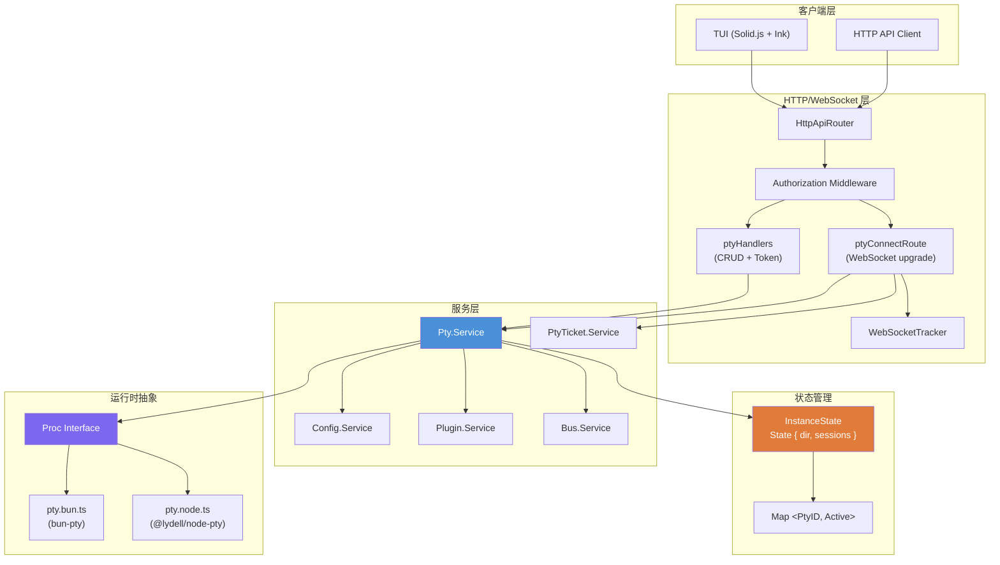
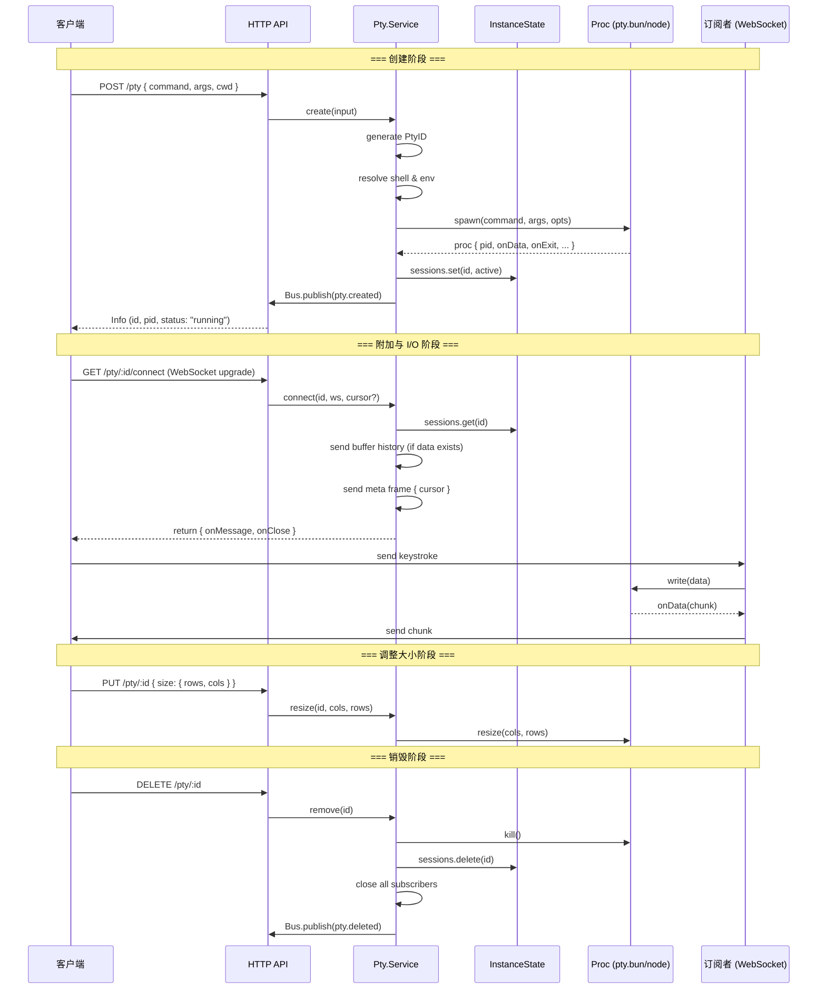
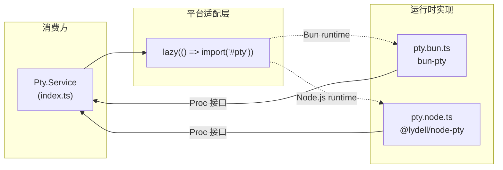
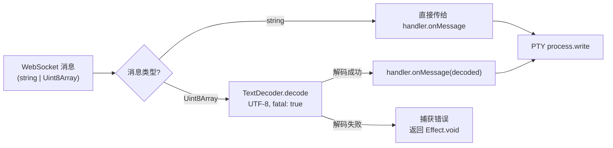
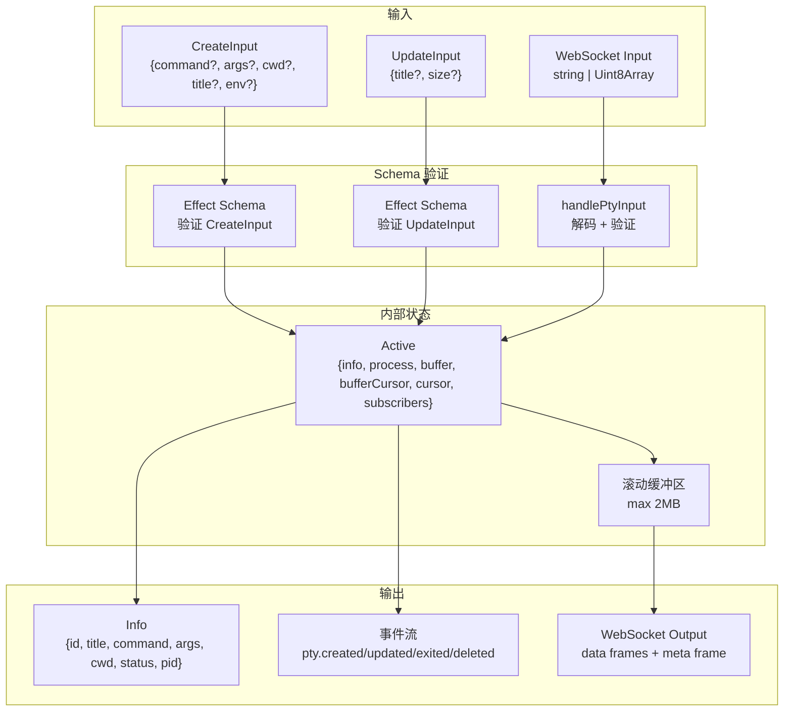
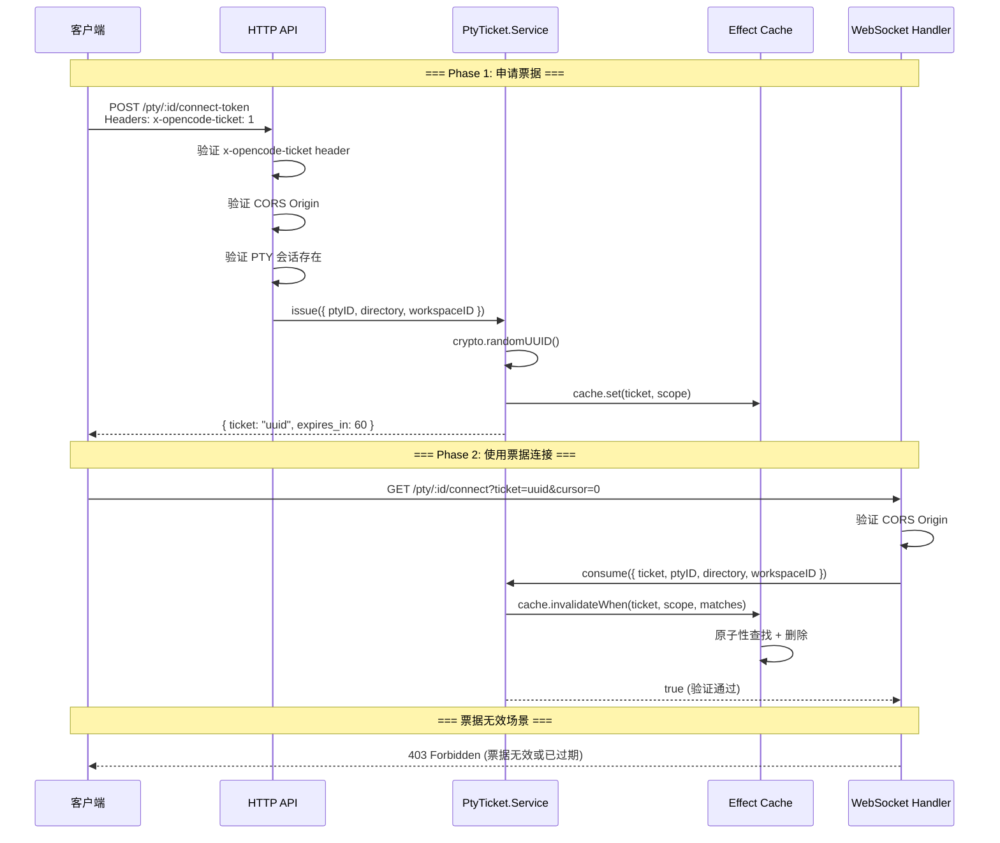
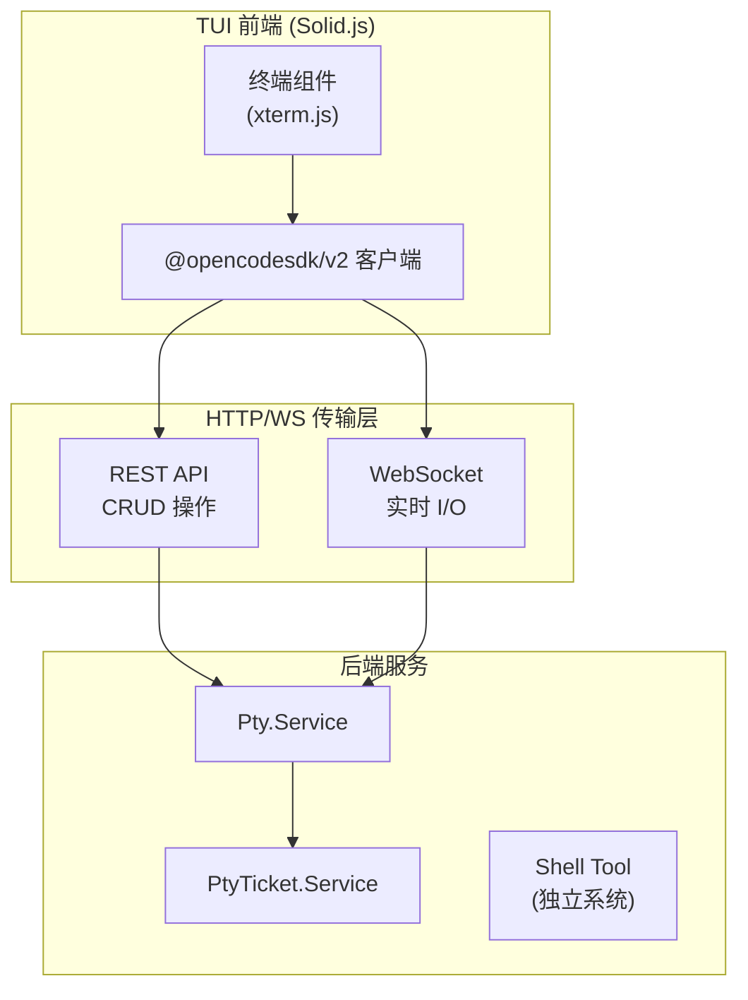
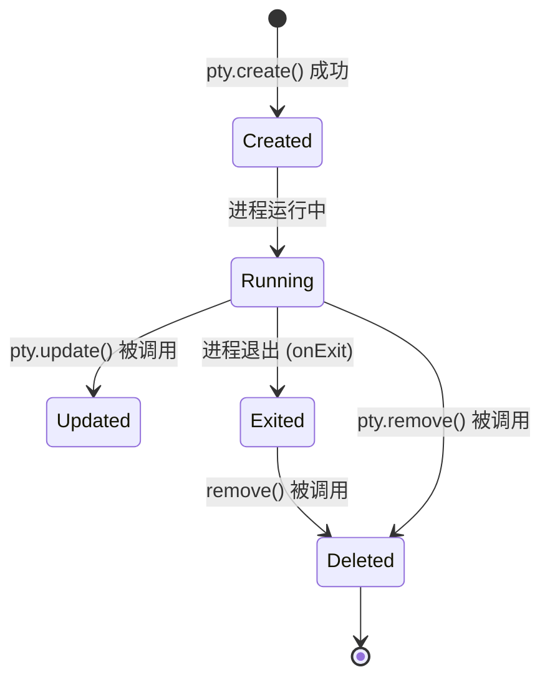

# OpenCode PTY（伪终端）管理系统

## 目录

1. [概述](#概述)
2. [核心类型定义](#核心类型定义)
3. [系统架构](#系统架构)
4. [PTY 生命周期](#pty-生命周期)
5. [Bun 与 Node.js 实现差异](#bun-与-nodejs-实现差异)
6. [输入处理与按键处理](#输入处理与按键处理)
7. [Schema 类型与数据流](#schema-类型与数据流)
8. [基于 Ticket 的访问控制](#基于-ticket-的访问控制)
9. [与 Shell Tool 和 TUI 的集成](#与-shell-tool-和-tui-的集成)
10. [HTTP API 路由](#http-api-路由)
11. [缓冲区管理](#缓冲区管理)
12. [事件系统](#事件系统)

---

## 概述

OpenCode 的 PTY（Pseudo-Terminal，伪终端）管理系统负责为 AI Agent 提供交互式 Shell 执行环境。与传统的Shell工具（一次性执行命令并返回结果）不同，PTY 系统维护持久的终端会话，支持实时双向 I/O 流、终端尺寸调整、多客户端订阅，以及通过 WebSocket 进行的实时交互。

PTY 子系统位于 `/home/hzh/wiki/opencode/packages/opencode/src/pty/` 目录下，由以下核心文件组成：

| 文件 | 职责 |
|------|------|
| `pty.ts` | 核心类型定义（`Proc`、`Opts`、`Exit`、`Disp`） |
| `pty.bun.ts` | Bun 运行时下的 PTY 实现，基于 `bun-pty` |
| `pty.node.ts` | Node.js 运行时下的 PTY 实现，基于 `@lydell/node-pty` |
| `index.ts` | PTY 服务主体，包含完整的生命周期管理、I/O 处理、WebSocket 分发 |
| `input.ts` | WebSocket 输入解码与安全处理 |
| `schema.ts` | PTY 身份标识符的类型定义与校验 |
| `ticket.ts` | 基于 Effect Cache 的短期票据访问控制系统 |

---

## 核心类型定义

`pty.ts` 文件定义了整个 PTY 系统的基础抽象，是 Bun 和 Node.js 实现共同遵循的接口契约：

```typescript
// 可释放资源的通用表示
export type Disp = {
  dispose(): void
}

// 进程退出事件
export type Exit = {
  exitCode: number
  signal?: number | string
}

// 创建 PTY 进程时的配置选项
export type Opts = {
  name: string        // 终端类型名称（固定 "xterm-256color"）
  cols?: number       // 终端列数
  rows?: number       // 终端行数
  cwd?: string        // 工作目录
  env?: Record<string, string>  // 环境变量
}

// PTY 进程的核心接口
export type Proc = {
  pid: number                                          // 进程 ID
  onData(listener: (data: string) => void): Disp       // 数据接收订阅
  onExit(listener: (event: Exit) => void): Disp        // 进程退出订阅
  write(data: string): void                            // 向 PTY 写入数据
  resize(cols: number, rows: number): void             // 调整终端尺寸
  kill(signal?: string): void                          // 终止进程（可指定信号）
}
```

**关键设计决策：**

- `Proc` 类型基于 **观察者模式**：`onData` 和 `onExit` 返回 `Disp` 对象，调用 `dispose()` 即可取消监听。
- `Opts.name` 固定为 `xterm-256color`，确保终端的颜色和功能一致性。
- 接口抽象了底层实现差异，使得上层服务无需关心运行时环境。

---

## 系统架构



### 服务依赖链

PTY 服务通过 Effect Layer 机制进行依赖注入。其运行时组合方式如下：

```
Pty.Service
  ├── Config.Service    (读取配置，确定默认 Shell)
  ├── Bus.Service       (发布生命周期事件)
  └── Plugin.Service    (触发 shell.env 钩子获取环境变量)
```

PTY 服务本身作为应用层的一部分被注册到 `AppLayer` 中（见 `app-runtime.ts`）：

```typescript
// app-runtime.ts 第 104-105 行
Pty.defaultLayer,
PtyTicket.defaultLayer,
```

`Pty.defaultLayer` 定义为：

```typescript
export const defaultLayer = layer.pipe(
  Layer.provide(Bus.layer),
  Layer.provide(Plugin.defaultLayer),
  Layer.provide(Config.defaultLayer),
)
```

---

## PTY 生命周期

PTY 会话的完整生命周期包含五个阶段：**创建** → **附加** → **I/O** → **调整大小** → **销毁**。

### 生命周期流程图



### 阶段详解

#### 1. 创建阶段 (`create`)

创建发生在 `index.ts` 的 `create` 函数中（第 176-264 行）：

1. **生成唯一 ID**：通过 `PtyID.ascending()` 生成格式为 `pty_<timestamp>` 的唯一标识符。
2. **解析 Shell**：
   - 优先使用客户端传入的 `command`，否则调用 `Shell.preferred(cfg.shell)` 获取系统推荐 Shell。
   - 对于需要登录 Shell 的类型（bash, zsh, sh 等），自动追加 `-l` 参数。
3. **确定工作目录**：使用客户端传入的 `cwd`，或回退到 InstanceState 记录的目录。
4. **组装环境变量**：
   - 继承 `process.env`
   - 合并客户端传入的 `env`
   - 通过插件钩子 `shell.env` 收集额外环境变量
   - 强制设置 `TERM=xterm-256color` 和 `OPENCODE_TERMINAL=1`
   - Windows 平台额外设置 UTF-8 locale
5. **动态导入 PTY 实现**：通过 `lazy(() => import("#pty"))` 延迟加载平台特定的 `spawn` 函数。
6. **启动进程**：调用 `spawn(command, args, opts)` 创建底层 PTY 进程。
7. **建立订阅**：
   - 注册 `onData` 回调：将输出推送给所有 WebSocket 订阅者，同时管理滚动缓冲区。
   - 注册 `onExit` 回调：发布 `pty.exited` 事件，触发会话删除。
8. **发布事件**：通过消息总线发布 `pty.created` 事件。

**`Active` 类型**（表示运行中的会话）：

```typescript
type Active = {
  info: Info           // 会话元数据
  process: Proc        // 底层 PTY 进程实例
  buffer: string       // 滚动缓冲区（累计输出）
  bufferCursor: number  // 缓冲区起始游标（从 0 递增）
  cursor: number       // 当前输出总长度
  subscribers: Map<unknown, Socket>  // WebSocket 订阅者映射
}
```

#### 2. 附加阶段 (`connect`)

连接发生在 `connect` 函数中（第 297-356 行）：

1. **查找会话**：从 `sessions` Map 中获取对应的 Active 对象。
2. **注册订阅者**：使用 `sock(ws)` 提取 Socket 的实际数据对象作为键（处理代理层），将 WebSocket 添加到 `subscribers` Map。
3. **发送历史数据**：
   - 基于三个游标计算数据区间：`start`（bufferCursor，缓冲区起始）、`end`（cursor，输出总长度）、`from`（客户端请求的游标位置）。
   - 如果客户端请求的 `cursor` 为 `-1`，从末尾开始（实时模式）。
   - 如果 `cursor` 为 `undefined` 或未指定，从缓冲区起始开始。
   - 以 `BUFFER_CHUNK`（64KB）为单位分块发送历史数据，避免大块数据传输阻塞。
4. **发送游标元数据帧**：发送格式为 `\x00{json}` 的控制帧，其中 `json` 为 `{"cursor": <end>}`，告知客户端当前数据流的末尾位置。
5. **返回处理函数**：
   - `onMessage`：将接收到的消息直接写入 PTY 进程。
   - `onClose`：从订阅者列表中移除当前连接。

**Meta 控制帧协议**：

```typescript
// WebSocket 控制帧格式: 0x00 + UTF-8 JSON
const meta = (cursor: number) => {
  const json = JSON.stringify({ cursor })
  const bytes = encoder.encode(json)
  const out = new Uint8Array(bytes.length + 1)
  out[0] = 0   // 控制帧标识
  out.set(bytes, 1)
  return out
}
```

以 `\x00` 字节开头的消息为控制帧，承载结构化元数据；其他所有数据帧为纯文本 PTY 输出。

#### 3. I/O 阶段

**数据输出流**（`onData` 回调，第 231-255 行）：

1. 进程输出到达时，更新 `session.cursor`。
2. 遍历所有订阅者，清理已断开或已失效的 WebSocket 连接。
3. 向每个活跃的 WebSocket 发送数据块。
4. 将数据追加到滚动缓冲区，若超过 `BUFFER_LIMIT`（2MB），则丢弃最早的数据并更新 `bufferCursor`。

**数据输入流**（`onMessage` 回调，第 348 行）：

- 直接将接收到的字符串或二进制数据写入底层 PTY 进程的 `write` 方法。

#### 4. 调整大小阶段 (`resize`)

两处触发 resize：

1. **显式 API 调用**：POST/PUT `update` API，传入 `size: { rows, cols }`。
2. **程序调用**：直接调用 `Pty.resize(id, cols, rows)`（第 281-287 行），仅当会话状态为 `"running"` 时执行底层 `process.resize()`。

#### 5. 销毁阶段

销毁可通过两条路径触发：

**主动删除**（`remove` 函数，第 156-163 行）：
1. 从 `sessions` Map 中移除。
2. 调用 `teardown`：终止进程 (`kill`)，关闭所有 WebSocket 连接，清空订阅者列表。
3. 发布 `pty.deleted` 事件。

**被动退出**（`onExit` 回调，第 256-262 行）：
1. 使用防御性检查避免重复处理（`info.status === "exited"` 守卫）。
2. 更新状态为 `"exited"`。
3. 通过 EffectBridge 异步发布 `pty.exited` 事件并调用 `remove`。

**InstanceState 终结器**（第 143-149 行）：
- 当 InstanceState 的生命周期结束时（如工作区关闭），自动遍历并关闭所有活跃会话。

---

## Bun 与 Node.js 实现差异

### 代码结构对比

**Bun 实现** (`pty.bun.ts`)：

```typescript
import { spawn as create } from "bun-pty"
import type { Opts, Proc } from "./pty"

export function spawn(file: string, args: string[], opts: Opts): Proc {
  const pty = create(file, args, opts)
  return {
    pid: pty.pid,
    onData(listener) { return pty.onData(listener) },
    onExit(listener) { return pty.onExit(listener) },
    write(data) { pty.write(data) },
    resize(cols, rows) { pty.resize(cols, rows) },
    kill(signal) { pty.kill(signal) },
  }
}
```

**Node.js 实现** (`pty.node.ts`)：

```typescript
import * as pty from "@lydell/node-pty"  // @ts-expect-error (缺少类型声明)
import type { Opts, Proc } from "./pty"

export function spawn(file: string, args: string[], opts: Opts): Proc {
  const proc = pty.spawn(file, args, opts)
  return {
    pid: proc.pid,
    onData(listener) { return proc.onData(listener) },
    onExit(listener) { return proc.onExit(listener) },
    write(data) { proc.write(data) },
    resize(cols, rows) { proc.resize(cols, rows) },
    kill(signal) { proc.kill(signal) },
  }
}
```

### 关键差异

| 维度 | Bun (`bun-pty`) | Node.js (`@lydell/node-pty`) |
|------|-----------------|------------------------------|
| 运行环境 | Bun runtime | Node.js runtime |
| 库来源 | 原生 Bun 模块，无额外依赖 | npm 包 `@lydell/node-pty`（fork 版本） |
| 类型支持 | 直接导入，无需标注 | 使用 `@ts-expect-error` 抑制类型错误 |
| 底层机制 | 利用 Bun 的内置 PTY 支持 | 调用系统级 PTY API（`forkpty` / `openpty`） |
| 导入方式 | 标准 ES import | 标有 `@ts-expect-error` 的 import |

### 动态加载机制

`index.ts` 通过懒加载选择正确的实现：

```typescript
const pty = lazy(() => import("#pty"))
```

`#pty` 是一个条件导入路径，在构建时根据目标运行时解析为：
- Bun 环境：`./pty.bun.ts`
- Node.js 环境：`./pty.node.ts`

在 `create` 函数中使用时（第 204 行）：

```typescript
const { spawn } = yield* Effect.promise(() => pty())
const proc = yield* Effect.sync(() => spawn(command, args, { ... }))
```

通过 `Effect.promise` 包装懒加载，确保 PTY 模块在首次使用时才被动态导入，从而支持同构代码在两种运行时上正确运行。

### 接口一致性

两种实现都返回完全相同的 `Proc` 接口，因此上层 `index.ts` 中的业务逻辑无需任何条件判断：



---

## 输入处理与按键处理

`input.ts` 负责将 WebSocket 接收到的原始数据安全地转换为 PTY 可以写入的字符串。

### 数据流



### 实现细节

```typescript
const inputDecoder = new TextDecoder("utf-8", { fatal: true })

export function handlePtyInput(
  handler: { onMessage: (message: string | ArrayBuffer) => void },
  message: string | Uint8Array,
) {
  if (typeof message === "string") {
    handler.onMessage(message)
    return Effect.void
  }
  return Effect.try({
    try: () => inputDecoder.decode(message),
    catch: () => new Error("invalid PTY websocket input"),
  }).pipe(
    Effect.catch(() => Effect.succeed(undefined)),
    Effect.flatMap((decoded) => {
      if (decoded === undefined) return Effect.void
      handler.onMessage(decoded)
      return Effect.void
    }),
  )
}
```

**关键设计点：**

- **fatal: true 解码器**：`TextDecoder` 使用 `fatal: true` 模式，遇到无效 UTF-8 字节序列时直接抛出异常，而非静默替换为替换字符（U+FFFD），避免将损坏数据传入 Shell。
- **双层错误处理**：`Effect.try` 捕获解码异常，`Effect.catch` 将其转换为成功值（`undefined`），确保无效输入不会导致 WebSocket 连接崩溃。
- **字符串直通**：如果消息已经是字符串，则跳过解码步骤直接传递。
- **返回值统一**：始终返回 `Effect.void`，符合 Effect 系统的 composable 约定。

### 在 WebSocket 路由中的使用

该函数在 `ptyConnectRoute` 中被调用（`handlers/pty.ts` 第 163 行）：

```typescript
yield* socket
  .runRaw((message) => handlePtyInput(handler, message))
```

**重要：WebSocket 时序保证**

代码中的注释明确指出了一个重要的时序问题（第 156-161 行）：

> `request.upgrade` 返回一个 Socket 但尚未完成 WebSocket 握手。握手在 `socket.runRaw` 内部触发，发生在 `pty.connect` 解析完成且消息回调注册之后。因此客户端在 listener 绑定之前无法触发 `open` 事件并开始发送消息。不应将 `runRaw` 移到 `pty.connect` 之前而不重新引入帧缓冲。

这意味着连接流程必须严格保证：
1. 先调用 `pty.connect` 注册消息处理器
2. 再通过 `socket.runRaw` 启动 WebSocket 消息循环

---

## Schema 类型与数据流

### PtyID 标识符

`schema.ts` 定义了 PTY 会话的唯一标识符体系：

```typescript
const ptyIdSchema = Schema.String
  .check(Schema.isStartsWith("pty"))   // 必须以 "pty" 开头
  .pipe(Schema.brand("PtyID"))         // 品牌类型，防止 ID 混用

export const PtyID = ptyIdSchema.pipe(
  withStatics((schema) => ({
    ascending: (id?: string) => schema.make(Identifier.ascending("pty", id)),
    zod: zod(schema),
  })),
)
```

- **格式**：`pty_<ascending_id>`，例如 `pty_01ABC123XYZ`
- **ascending 生成**：基于时间戳保证全局唯一且大致有序
- **品牌类型**：通过 `Schema.brand` 确保 PtyID 不能与普通 String 混用
- **双验证支持**：同时提供 Effect Schema 和 Zod schema（用于 HTTP API 参数验证）

### Info 类型

```typescript
export const Info = Schema.Struct({
  id: PtyID,
  title: Schema.String,
  command: Schema.String,
  args: Schema.Array(Schema.String),
  cwd: Schema.String,
  status: Schema.Literals(["running", "exited"]),
  pid: PositiveInt,
})
```

`Info` 是 PTY 会话的公开元数据，通过 API 返回给客户端。其中 `PositiveInt` 保证了 `pid` 始终为正整数。

### CreateInput 与 UpdateInput

```typescript
export const CreateInput = Schema.Struct({
  command: Schema.optional(Schema.String),
  args: Schema.optional(Schema.Array(Schema.String)),
  cwd: Schema.optional(Schema.String),
  title: Schema.optional(Schema.String),
  env: Schema.optional(Schema.Record(Schema.String, Schema.String)),
})

export const UpdateInput = Schema.Struct({
  title: Schema.optional(Schema.String),
  size: Schema.optional(Schema.Struct({
    rows: PositiveInt,
    cols: PositiveInt,
  })),
})
```

所有字段皆为可选：`command` 未指定时自动解析系统 Shell，`cwd` 未指定时使用当前工作目录。

### 数据流总览



---

## 基于 Ticket 的访问控制

### 设计目的

PTY WebSocket 连接需要权限验证，但 WebSocket 升级请求无法携带自定义 HTTP 头。Ticket 系统通过以下流程解决此问题：

1. 客户端先通过受保护的 HTTP API 获取一个短期有效的一次性票据（Token）。
2. 客户端在 WebSocket 连接的 URL 查询参数中携带该票据。
3. 服务端在 WebSocket 升级前验证并消费该票据。

### 票据模型

```typescript
export const ConnectToken = Schema.Struct({
  ticket: Schema.String,       // UUID 格式的票据
  expires_in: PositiveInt,     // 过期秒数（≥1）
})

export type Scope = {
  readonly ptyID: PtyID        // 目标 PTY 会话 ID
  readonly directory?: string  // 工作目录（可选约束）
  readonly workspaceID?: string  // 工作区 ID（可选约束）
}
```

### 工作流程



### 实现细节

**默认 TTL**：60 秒，通过 `DEFAULT_TTL = Duration.seconds(60)` 定义。

**缓存容量**：10,000 条（`CAPACITY = 10_000`），使用 LRU 策略淘汰。

**票据签发** (`issue` 函数，第 46-49 行)：

```typescript
issue: Effect.fn("PtyTicket.issue")(function* (input) {
  const ticket = crypto.randomUUID()
  yield* Cache.set(cache, ticket, input)
  return { ticket, expires_in: expiresIn }
})
```

- 使用 `crypto.randomUUID()` 生成高质量随机票据。
- `expires_in` 通过 `Math.max(1, Math.round(Duration.toSeconds(ttl)))` 计算，确保至少为 1 秒。

**票据消费** (`consume` 函数，第 51-53 行)：

```typescript
consume: Effect.fn("PtyTicket.consume")(function* (input) {
  return yield* Cache.invalidateWhen(cache, input.ticket, (stored) => matches(stored, input))
})
```

- 使用 `Cache.invalidateWhen` 实现原子性的一次性消费（查找 + 删除），防止票据重用。
- `matches` 函数比较 `ptyID`、`directory` 和 `workspaceID`，确保票据与目标会话完全匹配。

**noLookup 守卫**：

```typescript
const noLookup = () => Effect.die("PtyTicket cache must be used via set/invalidateWhen, never get")
```

任何试图调用普通 `cache.get()` 的行为将触发 `Effect.die`（致命错误），从而保证票据只能通过 `set/invalidateWhen` 模式使用。

### 认证中间件集成

`authorization.ts` 中，PTY 连接路由被特殊处理（第 101-102 行）：

```typescript
if (hasPtyConnectTicketURL(url)) return yield* effect
// ... 否则执行标准 Basic Auth 验证
```

`hasPtyConnectTicketURL`（`pty-ticket.ts`）检查两个条件：
1. URL 路径匹配 `/^\/pty\/[^/]+\/connect$/`
2. 查询参数中包含 `ticket`

同时，`connectToken` 端点还有一个额外的头部验证（第 73 行）：

```typescript
if (request.headers[PTY_CONNECT_TOKEN_HEADER] !== PTY_CONNECT_TOKEN_HEADER_VALUE || ...)
```

其中：
```typescript
export const PTY_CONNECT_TOKEN_HEADER = "x-opencode-ticket"
export const PTY_CONNECT_TOKEN_HEADER_VALUE = "1"
```

这确保了只有知道此特殊头部的内部客户端才能请求票据。

---

## 与 Shell Tool 和 TUI 的集成

### 与 Shell Tool 的关系

**Shell Tool** (`/tool/shell.ts`) 和 **PTY System** 是 OpenCode 中两个互补但设计不同的命令执行机制：

| 特性 | Shell Tool | PTY System |
|------|-----------|------------|
| 执行模式 | 一次性、批处理式 | 持久性、交互式 |
| I/O 模型 | 单向流：命令 → 输出 | 双向流：实时输入/输出 |
| 生命周期 | 命令完成后退出 | 手动关闭或进程退出 |
| 输入来源 | 无交互输入（stdin: "ignore"） | WebSocket 实时输入 |
| 输出处理 | 截断、保存到文件 | 滚动缓冲区（2MB 上限） |
| 权限检查 | tree-sitter 解析 + 权限询问 | 无（通过 Ticket 控制） |
| 用途 | AI Agent 执行工具调用（bash tool） | TUI 用户手动操作终端 |

**Shell Tool 使用 `ChildProcess`（`effect/unstable/process`）**，而非 PTY 系统：

```typescript
// shell.ts 第 292 行
function cmd(shell: string, command: string, cwd: string, env: NodeJS.ProcessEnv) {
  return ChildProcess.make(command, [], {
    shell,
    cwd,
    env,
    stdin: "ignore",    // 不接受交互输入
    detached: process.platform !== "win32",
  })
}
```

两者共享 **Shell 模块** (`/shell/shell.ts`) 用于：
- Shell 自动检测（bash, zsh, fish, nu, powershell, pwsh, cmd）
- 登录 Shell 判断
- Shell 参数构建

### 与 TUI 的集成

PTY 系统通过其 HTTP API 和 WebSocket 端点被 TUI 前端消费。TUI 使用 `@opencodesdk/v2` 客户端与后端通信。



**TUI App 初始化**（`app.tsx`）不直接依赖 PTY —— PTY 是后端功能，TUI 通过 `SDKProvider`（`@tui/context/sdk`）消费后端 API，其中包含了 PTY 相关的 SDK 方法。

**Attach 模式**（`attach.ts`）：
- `opencode attach <url>` 命令用于远程连接运行中的服务器
- 支持与 TUI Thread 相同的参数（--continue, --session, --fork, --dir）

---

## HTTP API 路由

PTY 系统通过 Effect HttpApi 暴露以下端点（定义于 `groups/pty.ts`）：

| 方法 | 路径 | 功能 | 认证 |
|------|------|------|------|
| `GET` | `/pty/shells` | 列出系统可用 Shell | 中间件链 |
| `GET` | `/pty` | 列出所有活跃 PTY 会话 | 中间件链 |
| `POST` | `/pty` | 创建新 PTY 会话 | 中间件链 |
| `GET` | `/pty/:ptyID` | 获取指定会话信息 | 中间件链 |
| `PUT` | `/pty/:ptyID` | 更新会话（标题/尺寸） | 中间件链 |
| `DELETE` | `/pty/:ptyID` | 删除并终止会话 | 中间件链 |
| `POST` | `/pty/:ptyID/connect-token` | 生成 WebSocket 连接票据 | x-opencode-ticket 头 + CORS |
| `GET` | `/pty/:ptyID/connect` | WebSocket 升级端点 | Ticket 验证 |

**中间件链**（按顺序）：

1. `InstanceContextMiddleware`：注入实例上下文（目录、工作区等）
2. `WorkspaceRoutingMiddleware`：工作区路由（多租户支持）
3. `Authorization`：认证中间件（Basic Auth，PTY 连接路径除外）

### WebSocket 连接端点详解

`ptyConnectRoute`（`handlers/pty.ts` 第 90-178 行）处理 WebSocket 升级：

1. 验证会话存在（404 如果不存在）
2. 验证 ticket（403 如果无效）
3. 解析 `cursor` 查询参数（可选，用于恢复历史输出）
4. 执行 WebSocket 升级
5. 注册到 `WebSocketTracker`（用于服务器关闭时的优雅断开）
6. 构建 `adapter` 对象桥接 WebSocket 与 PTY
7. 调用 `pty.connect` 获取消息处理器
8. 启动 `socket.runRaw` 消息循环

**WebSocketTracker**：在服务器关闭时统一通知所有活跃的 PTY WebSocket 连接，发送 `CloseEvent(1001, "server closing")`。

---

## 缓冲区管理

### 容量与分片

```typescript
const BUFFER_LIMIT = 1024 * 1024 * 2   // 2MB 硬上限
const BUFFER_CHUNK = 64 * 1024          // 64KB 分块传输
```

**缓冲区存储**在 `Active` 对象中：
- `buffer: string` — 所有 PTY 输出的累积文本
- `bufferCursor: number` — 缓冲区起始位置（当历史数据超出 BUFFER_LIMIT 时递增）
- `cursor: number` — 当前输出总长度（从进程启动计算的绝对位置）

### 缓冲区裁剪

当 `buffer.length > BUFFER_LIMIT` 时（第 251-254 行）：

```typescript
session.buffer += chunk
if (session.buffer.length <= BUFFER_LIMIT) return
const excess = session.buffer.length - BUFFER_LIMIT
session.buffer = session.buffer.slice(excess)
session.bufferCursor += excess
```

- 丢弃超出部分的最早数据。
- `bufferCursor` 递增以追踪丢弃的字节数，使客户端游标计算保持正确。

### 客户端游标系统

客户端可以通过 `cursor` 查询参数请求特定位置的数据：

| cursor 值 | 含义 |
|-----------|------|
| `-1` | 从末尾开始（实时模式，不发送历史数据） |
| `0` 到 `end` | 从指定位置发送后面的所有数据 |
| `undefined` / 未指定 | 默认从缓冲区起始位置发送（`bufferCursor`） |
| `> end` | 不发数据（客户端已拥有所有数据） |

游标计算（第 314-325 行）：

```typescript
const start = session.bufferCursor            // 缓冲区中最早数据的绝对位置
const end = session.cursor                     // 最新数据的绝对位置
const from = cursor === -1 ? end            // 实时模式
  : typeof cursor === "number" && Number.isSafeInteger(cursor)
    ? Math.max(0, cursor)
    : 0

const data = (() => {
  if (!session.buffer) return ""
  if (from >= end) return ""                   // 无新数据
  const offset = Math.max(0, from - start)      // 转换为缓冲区索引
  if (offset >= session.buffer.length) return ""
  return session.buffer.slice(offset)           // 提取数据
})()
```

---

## 事件系统

PTY 系统通过 `Bus`（消息总线）发布四类事件，所有事件定义在 `index.ts` 第 93-98 行：

```typescript
export const Event = {
  Created: BusEvent.define("pty.created", Schema.Struct({ info: Info })),
  Updated: BusEvent.define("pty.updated", Schema.Struct({ info: Info })),
  Exited:  BusEvent.define("pty.exited", Schema.Struct({ id: PtyID, exitCode: NonNegativeInt })),
  Deleted: BusEvent.define("pty.deleted", Schema.Struct({ id: PtyID })),
}
```

### 事件发布时机



| 事件 | 触发条件 | 发布位置 |
|------|---------|---------|
| `pty.created` | 新会话成功创建 | `create` 函数第 263 行 |
| `pty.updated` | 标题或尺寸被更新 | `update` 函数第 277 行 |
| `pty.exited` | 底层进程自然退出（exitCode 通过 onExit 回调接收） | `onExit` 回调第 260 行 |
| `pty.deleted` | 会话被主动删除或随 exit 事件级联删除 | `remove` 函数第 163 行 |

### 退出处理中的 EffectBridge

进程退出处理使用了 `EffectBridge`（第 260-262 行）：

```typescript
proc.onExit(({ exitCode }) => {
  if (session.info.status === "exited") return
  log.info("session exited", { id, exitCode })
  session.info.status = "exited"
  bridge.fork(bus.publish(Event.Exited, { id, exitCode }))
  bridge.fork(remove(id))
})
```

`bridge.fork` 用于在 onExit 回调（同步/非 Effect 上下文）中安全地派发 Effect 任务。`EffectBridge` 在 `create` 函数的 Effect scope 内创建（第 178 行），确保 fork 出去的任务在正确的 Effect 上下文中执行。

### 事件在 TUI 中的消费

TUI 监听 `session.deleted` 事件（`app.tsx` 第 813-820 行）：

```typescript
event.on("session.deleted", (evt) => {
  if (route.data.type === "session" && route.data.sessionID === evt.properties.info.id) {
    route.navigate({ type: "home" })
    toast.show({ variant: "info", message: "The current session was deleted" })
  }
})
```

当 PTY 会话关联的 Session 被删除时，TUI 自动导航回首页并显示提示。

---

## 总结

OpenCode 的 PTY 管理系统是一个完整的伪终端抽象层，具备以下关键特性：

1. **跨运行时抽象**：通过统一的 `Proc` 接口和动态导入，在 Bun 和 Node.js 之间无缝切换。
2. **多客户端订阅**：单个 PTY 会话可被多个 WebSocket 客户端同时观察和交互。
3. **滚动缓冲区**：2MB 环形缓冲区配合游标系统，支持客户端在不同位置接入历史数据。
4. **基于票据的安全模型**：一次性 UUID 票据 + Effect Cache 提供简单而安全的 WebSocket 认证。
5. **完整的生命周期事件**：通过消息总线向整个系统广播创建、更新、退出和删除事件。
6. **资源清理保证**：通过 InstanceState 终结器和进程退出回调确保资源不会泄漏。
7. **与认证系统集成**：ticket 机制无缝嵌入 Basic Auth 中间件，支持内部和外部客户端。
